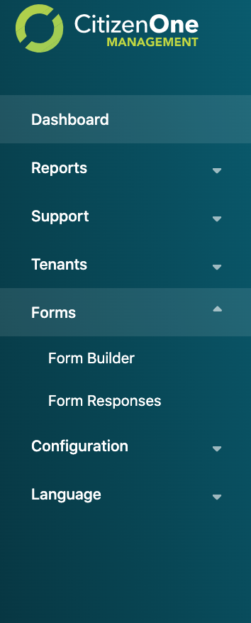

Form Management
==============

Creating Forms
****************************
.. image:: images/createForm.png
   :width: 500pt
   :align: left

In order to create a form you do the following:

1. Log into Management

2. Click the **[Forms -> Form Builder]** link

3. Click the **[+Create Form]** button
   The fields in order to create a form are:
    a. **Name** - The forms name
    b. **Description** - The forms description
    c. **Organization** - The forms organization
    d. **Application** - The application to tie it to in CitizenOne

.. image:: images/3.png

4. Add the details of the form

5. Click **[Submit]**

Adding Controls (Fields) to the form
****************************

A control/field is how a user will enter information on the form.
The current list of controls are:

**Form Structure** |
Step | FormattedText

.. image:: images/formStructure.png
    :width: 150pt  

**Text Controls** | 
Input | Multi Line Input | Password

.. image:: images/textControls.png
    :width: 150pt

**Typed Controls** | 
Number | Email Address | Phone Number

.. image:: images/typedControls.png
    :width: 150pt

**Date And Time Controls** | 
Date | Type | Date and Time

.. image:: images/dateTimeControls.png
    :width: 150pt

**Selection Controls** | 
Dropdown | Radio Buttons | Checkboxes | Yes/No Question 

.. image:: images/selectionControls.png
    :width: 150pt

**Buttons** | 
Button | Link

.. image:: images/buttons.png
    :width: 150pt

**Speciality** |
QR Code | Hidden Field

.. image:: images/specialty.png
    :width: 150pt

Adding controls to the forms happens when doing the following:

1. Creating a step.  Forms in CitizenOne can be multi-step forms.  So each **Step** in a form relates to a step in a form.

.. image:: images/5.png

2. Adding Fields to the step. 

- Select control on a left side panel

.. image:: images/selectionControls.png
    :width: 150pt

- Edit choosen control

    .. image:: images/addingControl.png

See the attributes for fields available here

.. image:: images/8a.png
.. image:: images/8b.png

3. Clicking **[Save]**

.. _viewing_forms:

Viewing Forms
****************************

Viewing forms happens on portal or on business server

.. _deleting_forms:

Deleting Forms
****************************
Click the **[Forms -> Form Builder]** link

Check the box beside the form you want to delete and click the garbage icon at the top of the table

.. image:: images/deleting.png
    :width: 500pt
