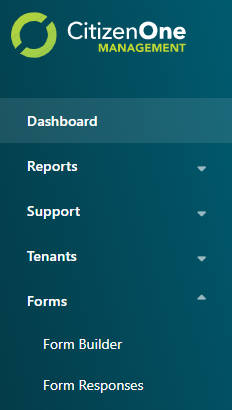

.. _form_management:

Form Management
==============

CitizenOne features a robust No-Code Form Builder that allows forms to be created without the need to write and deploy code. Forms can be attached a Service Card allowing citizens to complete and submit the form.

The list of all available Applications can be accessed by clicking [**Form Builder**] under the
[**Forms**] tab of the sidebar.

Viewing All Forms
*************************

The initial Form Builder page displays a list of all of the Forms
that have been created for your instance of CitizenOne.

From this page, you are able to click on a Form in the list for a more detailed view, or create a new Form.

.. _creating_forms:

Creating Forms
****************************

When a new form needs to be created, click the [**+ Create Form**] button.

.. image:: images/3.png
   :width: 500pt
   :alt: Create a new Form
   :align: center

The fields in order to create a form are:
1. **Name** - The name of the form
2. **Description** - A brief description of the form
3. **Organization** - The Organization that the form belongs to
4. **Application** - The Application to tie it to in CitizenOne

Clicking the [**Submit**] button will take you to a page to create the content on the form.

Adding Controls (Fields) to the form
^^^^^^^^^^^^^^^^^^^^^^^^^^^

A control/field is how a user will enter information on the form.
The current list of controls are:

**Form Structure** |
Step | FormattedText

.. image:: images/formStructure.png
    :width: 150pt  

**Text Controls** | 
Input | Multi Line Input | Password

**Typed Controls** | 
Number | Email Address | Phone Number

**Date And Time Controls** | 
Date | Type | Date and Time

.. image:: images/dateTimeControls.png
    :width: 150pt

**Selection Controls** | 
Dropdown | Radio Buttons | Checkboxes | Yes/No Question 

.. image:: images/selectionControls.png
    :width: 150pt

**Buttons** | 
Button | Link

**Speciality** |
QR Code | Hidden Field

.. image:: images/specialty.png
    :width: 150pt

Adding controls to the forms happens when doing the following:

1. Creating a step.  Forms in CitizenOne can be multi-step forms.  So each **Step** in a form relates to a step in a form.

.. image:: images/5.png

2. Adding Fields to the step. 

- Select control on a left side panel

.. image:: images/selectionControls.png
    :width: 150pt

- Edit choosen control

    .. image:: images/addingControl.png

See the attributes for fields available here

.. image:: images/8a.png
.. image:: images/8b.png

3. Clicking the [**Save**] button.

.. _viewing_forms:

Viewing Forms
****************************

Viewing forms happens on portal or on business server

.. _deleting_forms:

Deleting Forms
****************************

Check the box beside the form you want to delete and click the garbage icon at the top of the table.

