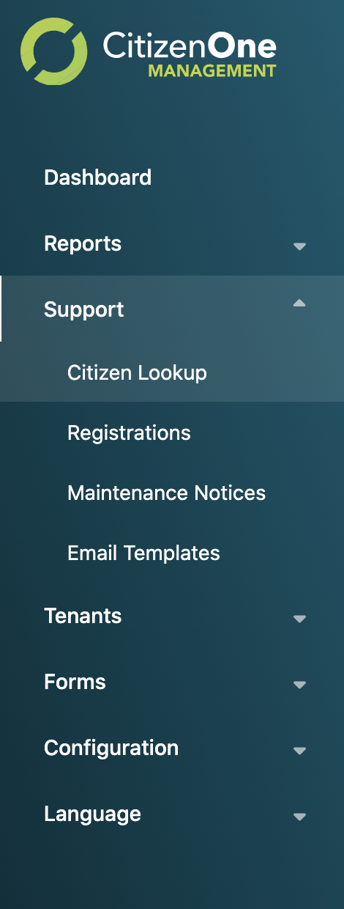
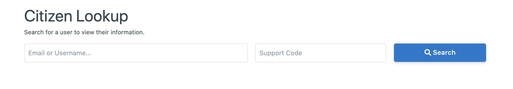
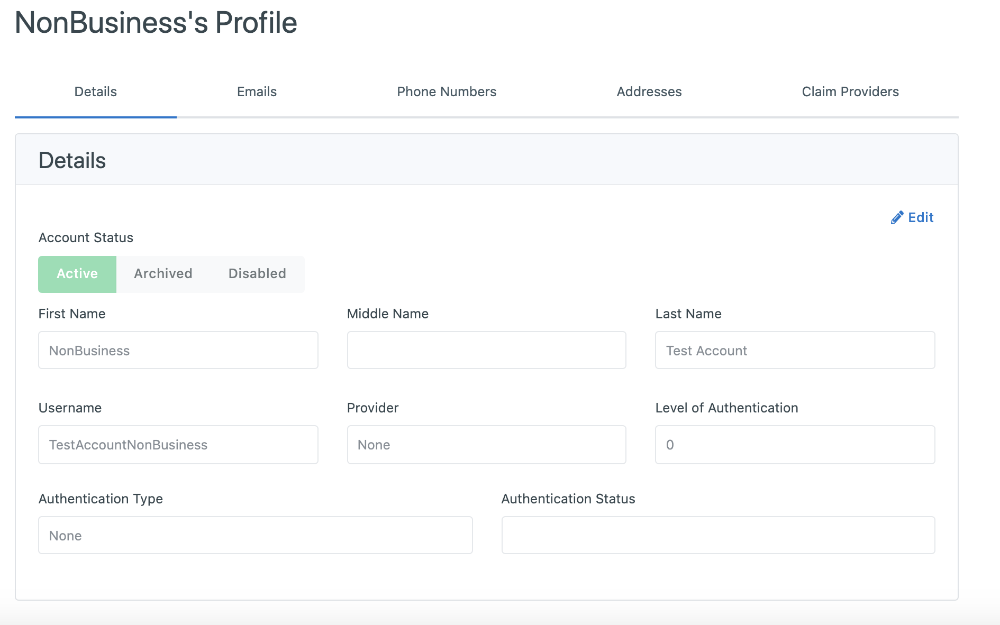
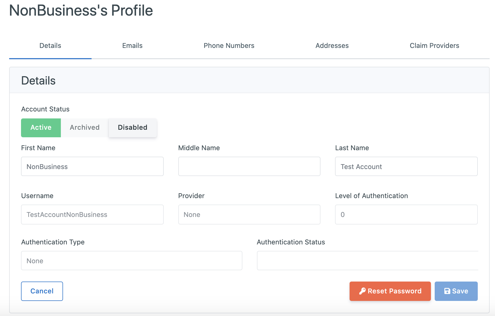
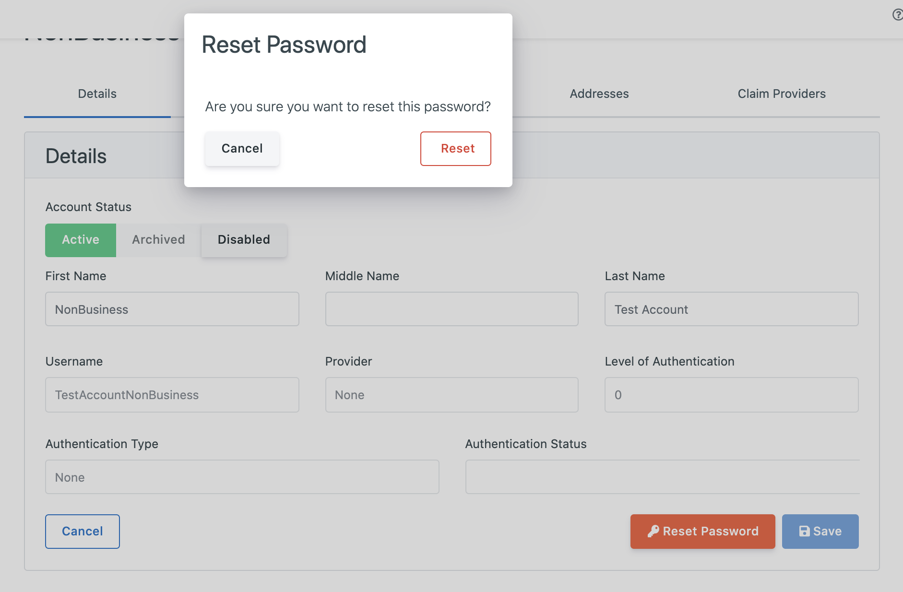
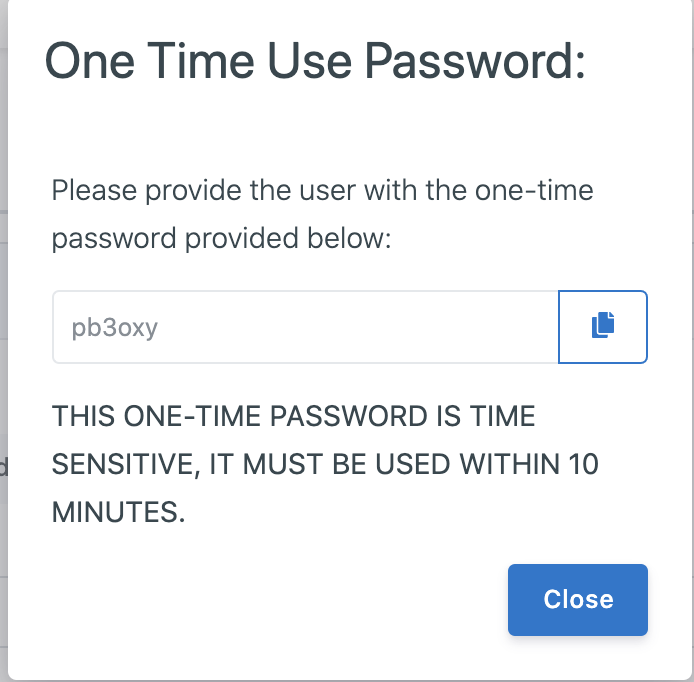

.. _CitizenOne_support:

CitizenOne Support
=======================

Administrators with the appropriate role(s) can support their instance of CitizenOne 
through several functions available in the Management Application – Citizen Lookup, Registrations, Maintenance Notices and Email Templates.

.. _sidebare_citizenlookup:

Citizen Lookup
*************************

Citizen Lookup allows administrators to view profile information about a specific citizen and make changes to the profile. 
In order to view the profile, the administrator must first enter the citizen’s username or email address as well as 
the 4-digit support code specified by the citizen during registration. 
If the information entered by the administrator matches a profile, the citizen’s profile is displayed. 

.. _viewing_citizenlookup:

Edit citizen details is able to reset password of the citizen, a TOTP (Time-based One Time Password) available within 10 minutes will be created for the citizen, 
the citizen has to use the TOTP to login and reset password in 10 minutes. 
The TOTP is only able to be created by admin to support end users when email of end users is unavailable, otherwise Forget Password should be uesed by end users to reset their password  by themself.

1. Clicking the [**Edit**] button 

2. A TOTP can be created by clicking the [**Reset Password**] button firstly.

3. then clicking [**Reset**] button

4. the following TOTP page includes a 6-digital one time used password for end users to reset a new password.

