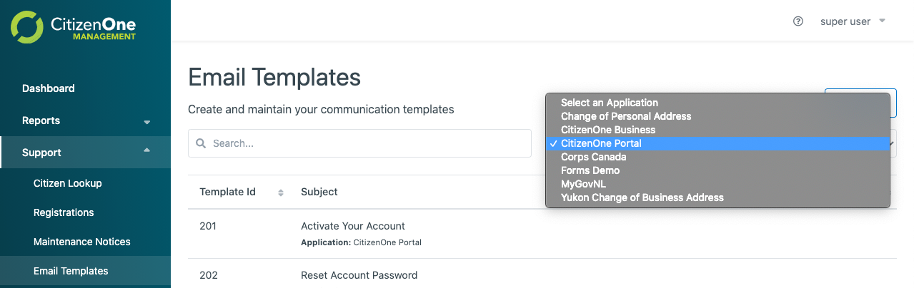
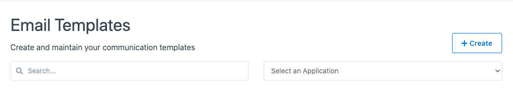
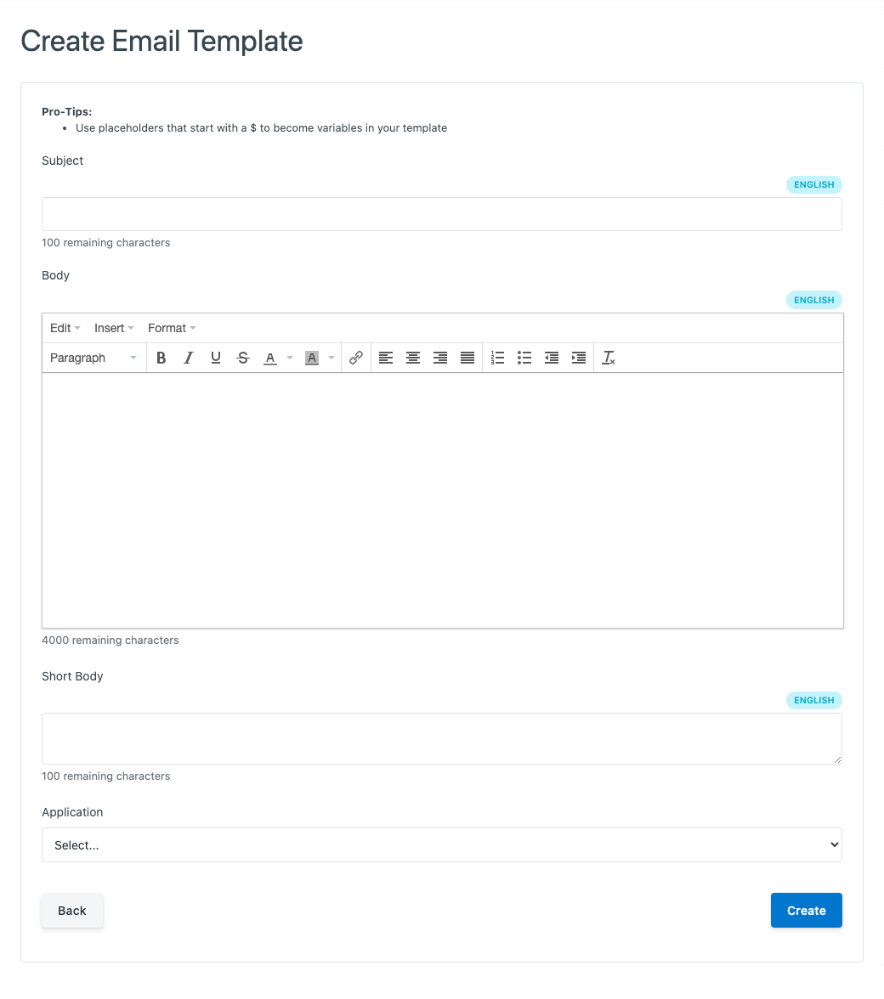
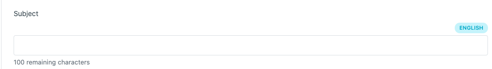

.. _email_template_management:

Email Template Management
=================

The CitizenOne Management application allows you to create and edit email templates for use inside Citizen One.

Email templates support translation, the introduction of custom variables, and can be assigned to a specific Application.

The list of all email templates for an application by selecting [**Email Templates**] under the
[**Support**] tab of the sidebar, and selecting the application from the [**Applications**] dropdown.

.. email_template_structure:

Email Template Structure
************************

If you would like to include values from CitizenOne in your email templates, the template will need to follow a simple
convention to mark the variables for replacement.

For any value that you would like inserted in your email subject, body, or short body, simply give a description of the
value, surrounded in a dollar sign and braces.

For example, if you want to include the recipient's first name in an email subject line, we can insert [**${FirstName}**]
in place.

Aside from this change, HTML email templates can be pasted into the management application as designed.

.. creating_email_templates:

Creating Email Templates
***********************

Once you've prepared any values in your HTML template, you're ready to add it to Citizen One.

To get started, click create in the top right of the Email Templates page:

This will bring you to a new view where you can fill out a few straightforward fields to create your new Email Template.

For Email Templates, the required fields are:

1. **Subject**: The first text recipients see after your sender name when an email reaches their inbox.
2. **Body**: The main content of the email once opened. This can either be plain text, or HTML.
3. **Short Body**: A shortened version of the main body that is surfaced by some email clients before the email is opened. (100 character limit)
4. **Application**: The application that this email template is intended for.

Clicking the [**Cancel**] button will not save any changes you made to the form, and you will be taken back to the
Email Templates listing page.

Clicking the [**Save**] button will then attempt to make a new Email Template, and you will be taken
back to the Email Templates listing page.

.. _managing_translations:

Managing translations
*********************

When filling out the email template form, you have the option of clicking on the [**English**] badge above any input to
switch to the English or French value for that field:

When your Email Template is saved, and English and French version will be generated and made available.
