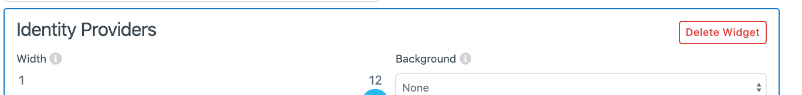

.. _layout_management:

Layout Management
=================

1. Log into Management

2. Click the **[Configuration -> Form Builder]** link

    .. image:: ../images/layouts/default.png
        :width: 500pt
        :align: left

3.  Default Login Layout Editor containst 3 widgets, 
    you can modify each of them. :

    a. **Basic login** 

    .. image:: ../images/layouts/login.png
        :width: 150pt

    When you click at the Basic login modification options will open. The widget will be selected by default, so feel free to resize it to your desired look. 

    .. image:: ../images/layouts/basicLogin.png
        :width: 500pt

    b. **Eeze login** 

    .. image:: ../images/layouts/eeze.png
        :width: 150pt

    When you click at the QR code Eeze login settings will open. The widget will be selected by default, so feel free to resize it to your desired look. 

    .. image:: ../images/layouts/eezeLogin.png
        :width: 500pt

    c. **Identity providers** 

    .. image:: ../images/layouts/providers.png
        :width: 200pt

    .. image:: ../images/layouts/providersSettings.png
        :width: 500pt   

**Provider Width:** Applies to ALL Identity Provider Cards the width of each Provider card within the Identity Providers widget.

**Identity Provider:** The desired Identity Provider you wish to link to with this card. Only enabled Identity Providers can be used.

**Icon URL:** A link to the image to be displayed at the top of the card.

**Colour:** The accent color of the Identity Provider card.

When the fields are filled in, you will be able to see a preview of the Provider’s card.

4. Delete widget

Click on **widget** choosen widget-> Click **Delete widget**

 
