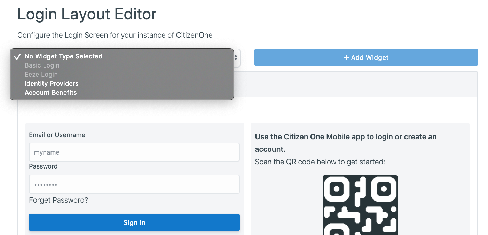

.. _layout_management:

Layout Management
=================

1. Log into Management
*****

2. Click the **[Configuration -> Login Layout]** link
**********

    .. image:: ../images/layouts/default.png
        :width: 500pt
        :align: left

3.  Default Login Layout Editor containst 3 widgets, 
    you can modify each of them. :
*************

    a. **Basic login** 

    .. image:: ../images/layouts/login.png
        :width: 150pt

    When you click at the Basic login, modification options will open. 
    The widget is stylized by default, so feel free to modify it to your desired look. 

    .. image:: ../images/layouts/basicLogin.png
        :width: 500pt

    b. **Eeze login** 

    .. image:: ../images/layouts/eeze.png
        :width: 150pt

    When you click at the QR code, Eeze login settings will open. 
    The widget will be stylized by default, so feel free to modify it to your desired look. 

    .. image:: ../images/layouts/eezeLogin.png
        :width: 500pt

    c. **Identity providers** 

    .. image:: ../images/layouts/providers.png
        :width: 200pt

    When you click at the Providers, settings will open. 

    .. image:: ../images/layouts/providersSettings.png
        :width: 500pt   

    **Provider Width:** Applies to ALL Identity Provider Cards the width of each Provider card within the Identity Providers widget.

    **Identity Provider:** The desired Identity Provider you wish to link to with this card. Only enabled Identity Providers can be used.

    **Icon URL:** A link to the image to be displayed at the top of the card.

    **Colour:** The accent color of the Identity Provider card.

When the fields are filled in, you will be able to see a preview of the Provider’s card.
The widget will be selected by default, so feel free to resize it to your desired look.
 
Click **[+Identity Provider]** to add an another Identity Provider card to the widget.

4. Delete widget
**************

Click on **widget** -> Click **Delete widget**

.. image:: ../images/layouts/deleteWidget.png
        :width: 500pt

 
5. Adding widget
***********

If you want to add more widgets to the screen, click at the dropdown, choose the widget and click **[+add Widget]**

6. Saving
**********
When you done click **[Save all]** in a  right, bottom corner

7. Cancel
***********
If you don't want to save changes click **[Cancel all]** in a left, bottom corner
