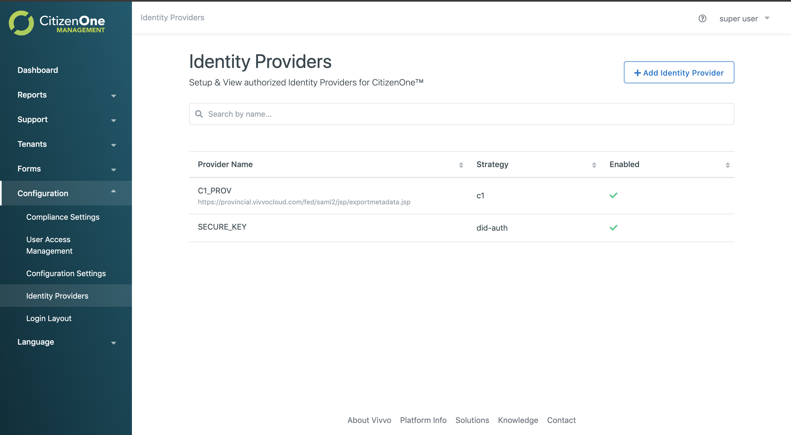
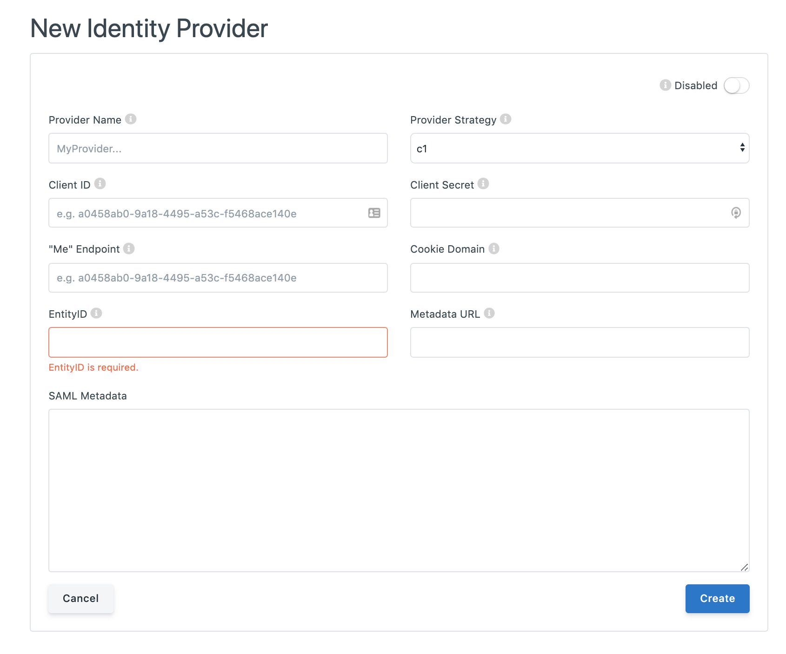
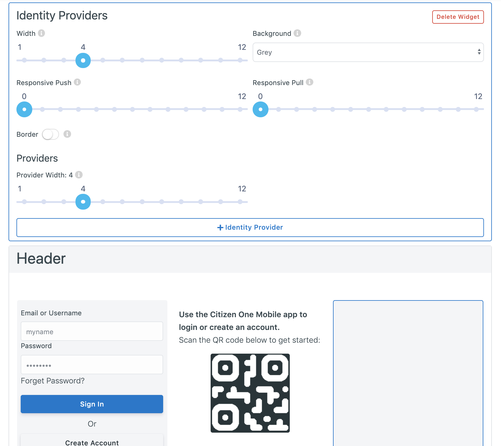
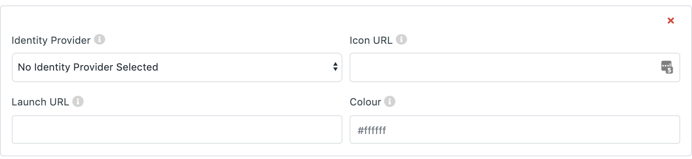
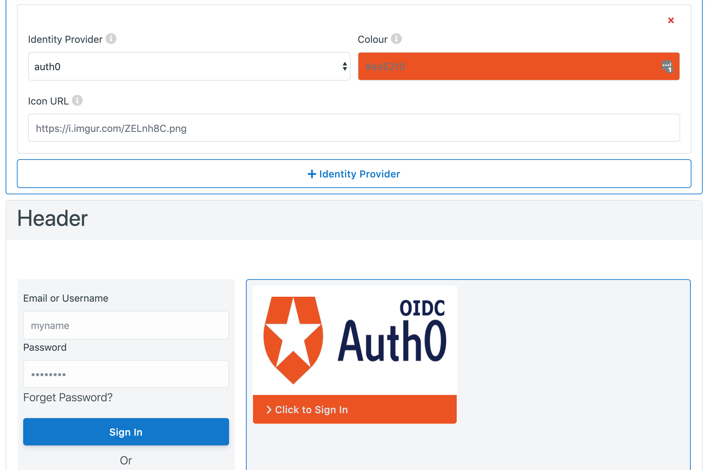
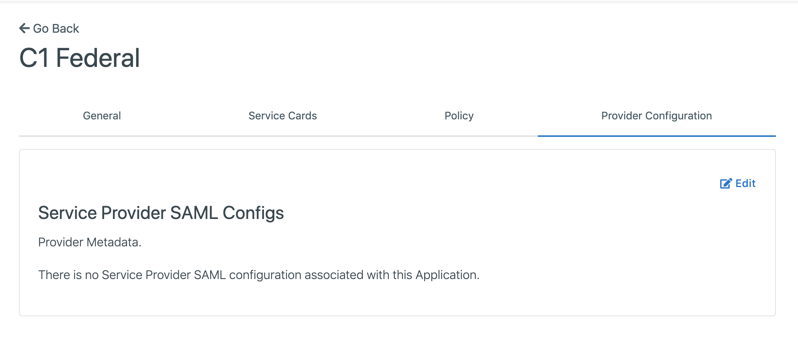
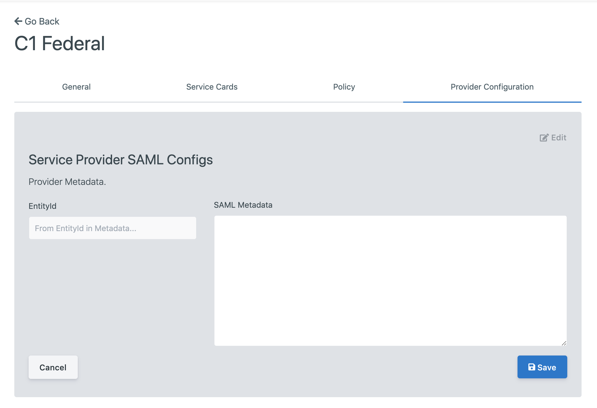

Platform Configuration
======================

Identity Providers
******************

Identity Providers are external applications or systems that are able to provide the
necessary details needed in order to sign users into CitizenOne, connecting the two
accounts.

For example, you'd be able to sign into the Federal version of CitizenOne with any
Provincal version's portal, so long as the integration is set up on both sides.

Setting up an Identity Provider
~~~~~~~~~~~~~~~~~~~~~~~~~~~~~~~
Just as there are two sides to any coin, there are two sides to any SAML transaction.
In order to connect two platforms to allow for Federation, both sides require the
other side's SAML metadata in order to authenticate with one another.

In this walkthrough, we will configure CitizenOne Federal such that it is able to
federate using another platform, CitizenOne Provincial.

As the Service Provider, CitizenOne Federal
-------------------------------------------

When logged into management, you can click "Configuration" to drop down a list,
where you will be able to find the link to the "Identity Providers" tab.

As you can see above, clicking into the tab displays a list of the currently setup
Identity Provider integrations. The one we will be aiming to replicate is `C1_PROV`.

Clicking "+ Add Identity Provider" will bring you to the setup screen for new
integrations.

- **Enabled**: Enables and disabled the Identity Provider. Disabling this here, will not remove the link on the login screen, however only enabled Identity Providers can be used to create links on the login page.
- **Provider Name**: The desired name of the Identity Provider you are setting up. This name is used in the launch URL, which we will be configuring later.
- **Provider Strategy**: There are varying methods of integrating with Identity Providers, but currently we only support dynamic SAML integrations, which is the `C1` strategy.
- **Client ID**: The public Client ID or Application Key of the Provider application.
- **Client Secret**: The private Client Secret or API Key of the Provider application.
- **"Me" Endpoind**: This is the endpoint with which the Service Provider, Federal, can call to retrieve the user's details from the Identity Provider, Provincial.
- **Cookie Domain**: The Service Provider's cookie domain.
- **EntityID**: (This field is filled in automatically) Globally unique name for the Identity Provider's SAML entity.
- **Metadata URL**: (NYI) A URL to call out to to retrieve the Identity Provider's SAML metdata.
- **SAML Metadata**: The SAML metadata, with a valid EntityID, supplied by the Identity Provider, Provincial. Filling out this field will automaticlaly populate the `EntityID` field.

.. note::
    If you forget what each of these fields are for, you can hover over the small `(i)` next to the field labels to get a short description of each.

Once all of the fields are filled out and valid, click "Save".

To set up the link to the Identity Provider on the login screen, drop down "Configuration" in the sidebar again,
but click into "Login Layout". For a full overview on this screen, please see :ref:`layout_management`.
In this tutorial, the assumption will be made that you have familiarized yourself with the Layout

.. image:: ../images/PlatformConfiguration/login-layout.png
   :width: 500pt
   :align: center

If you have the correct permissions, click into the dropdown box at the top
of the display, select "Identity Providers" and click "+ Add Widget" to add the
"Identity Providers" widget to the layout.

The widget will be selected by default, so feel free to resize it to your desired look.
Click "+ Identity Provider" to add an Identity Provider card to the widget.

A preview of the card is available in the display.

- **Provider Width**: **Applies to ALL Identity Provider Cards** the width of each Provider card within the Identity Providers widget.
- **Identity Provider**: The desired Identity Provider you wish to link to with this card. Only `enabled` Identity Providers can be used.
- **Icon URL**: A link to the image to be displayed at the top of the card.
- **Launch URL**: The URL used to kick of the transaction. (Typically, `http://my.service.com/saml/launch/IDENITY_PROVIDER_NAME`)
- **Colour**: The accent color of the Identity Provider card.

When the fields are filled in, you will be able to see a preview of the Provider's card.

`Here is an example where all of the widgets have a width of 4, and the Provider Width is set to 12 (full):`

Review your changes, and then hit save at the bottom of the page in order to set the layout.
Navigate to the login page of the service to see the changes.

As the Identity Provider, CitizenOne Provincial
-----------------------------------------------

When logged into management, click "Tenants" to drop down a list,
where you will be able to find the link to the "Applications" tab.

For more information on this screen, please see :ref:`application_management`

Following the steps outlined in :ref:`creating_applications`, you should
set up an application that represents the downstream service provider,
which is CitizenOne Federal. Select "CitizenOne" as the organization,
and **make sure you copy the Client Secret!**

One the application has been created, navigate to that applications
"Provider Configuration" tab, as shown below.

Click "Edit", and paste the SAML metadata provided by the Service Provider, CitizenOne Federal,
into the box. The SAML metadata must have a valid `EntityID`, or it will not be accepted.

