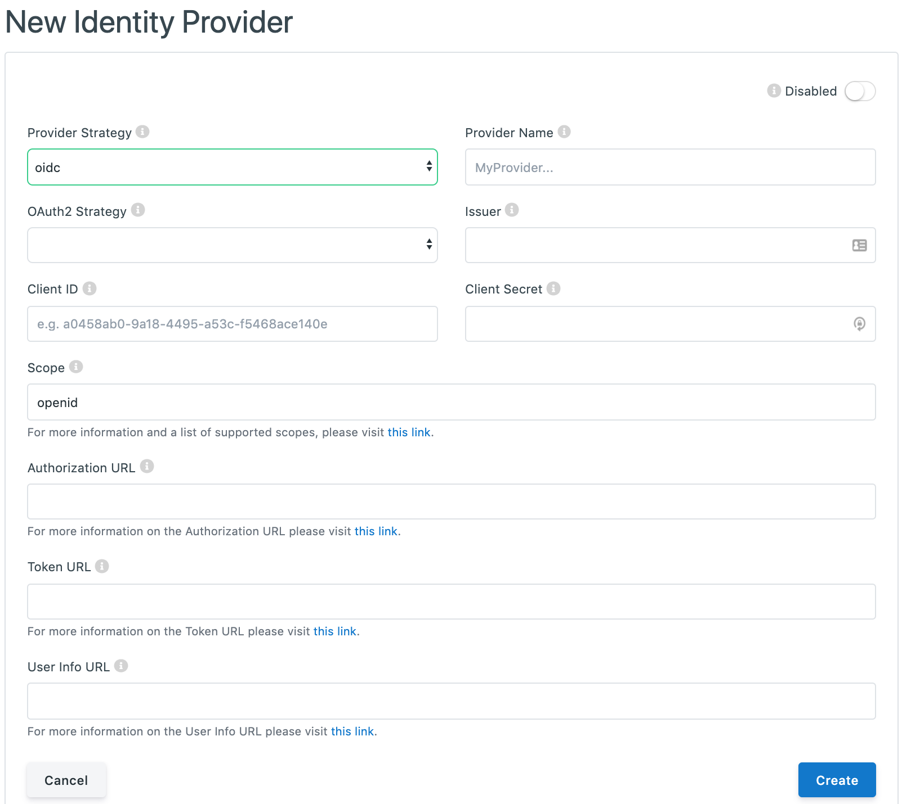
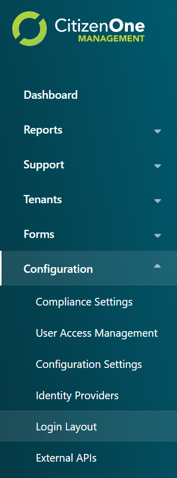
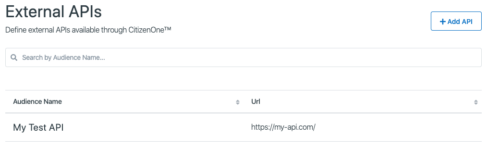
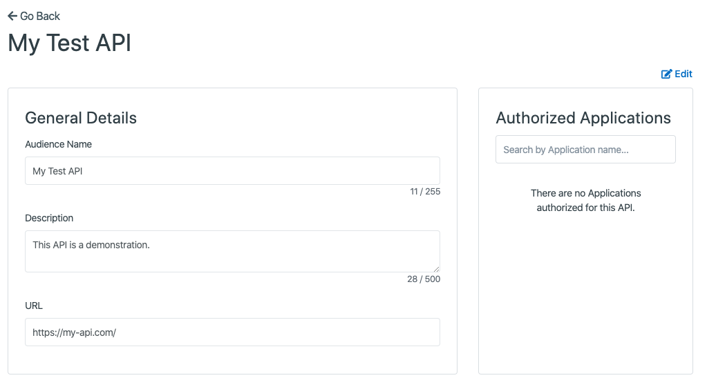
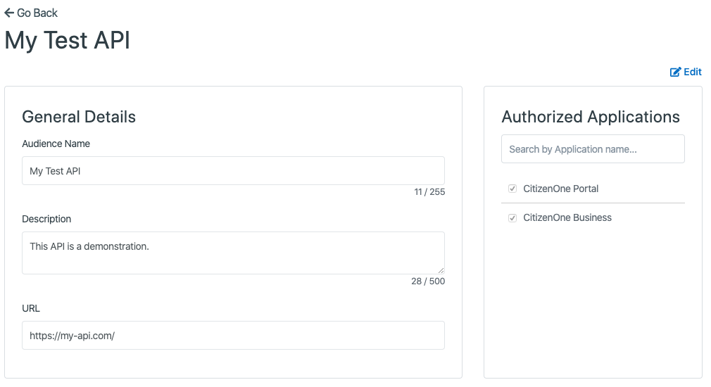

.. _platform_configuration:

Platform Configuration
======================

.. _platform_config_idp:

Identity Providers
******************

Identity Providers (IDPs) are external applications or systems that are able to provide the
necessary details needed in order to sign users into CitizenOne, connecting the two
accounts.

For example, you can configure CitizenOne to sign in using Facebook, Google, or even
another instance of CitizenOne, so long as the integration is set up on both sides.

The list of all available Identity Providers can be accessed by clicking [**Identity Providers**] under the
[**Configuration**] tab of the sidebar.

.. image:: ../images/PlatformConfiguration/identity-providers-nav.png
   :width: 100pt
   :alt: Sidebar with the Identity Providers tab selected
   :align: center

.. _platform_config_viewing_idp:

Viewing All Identity Providers
~~~~~~~~~~~~~~~~~~~~~~~~

The initial Identity Providers page displays a list of all of the Identity Providers
that have been configured for your instance of CitizenOne. Here, you can see a list of IDPs, the federation strategy (SAML, OIDC, etc) and if the IDP is active.

From this page, you are able to filter the displayed list of Identity Providers by their name,
click on an Identity Provider in the list for a more detailed view, or configure a new Idenity Provider.

.. image:: ../images/PlatformConfiguration/identity-providers-list.png
   :width: 500pt
   :alt: Viewing list of Identity Providers
   :align: center

.. _platform_config_configuring_idp:

Configuring a New Identity Provider
~~~~~~~~~~~~~~~~~~~~~~~~

When you've determined that a new Identity Provider is needed to be configured, you can click the [**+ Add Identity Provider**] button
in the top right of the Identity Providers listing page.

.. image:: ../images/PlatformConfiguration/identity-providers-create.png
   :width: 500pt
   :alt: Configure a new Identity Providers
   :align: center

This will bring you to a new view where you will be asked to fill out the vital information
needed to configure the Identity Provider. 

The general fields that need to be set for every Identity Provider are:

1. **Enabled/Disabled** toggle: When enabled, users will be able to sign in to CitizenOne using this IDP
2. **Provider Strategy**: The type of federation the IDP supports. Options include SAML, OIDC, and DID Auth   
3. **Provider Name**: The name of the IDP

Depending on the Provider Strategy selected, the remaining form to configure the IDP will change to capture the appropriate information to complete the configuration of the IDP.

.. note::
    If you forget what any of the fields are for, you can hover over the small `(i)` next to the field labels to get a short description of each.

.. _platform_config_configuring_idp_saml:

Setting up an Identity Provider with SAML (saml)
^^^^^^^^^^^^^^^^^^^^^^^^
Security Assertion Markup Language (SAML) is an open standard that allows Identity Providers to pass authorization credentials to Service Providers.
SAML transactions use Extensible Markup Language (XML) for standardized communications between the identity provider and service providers. SAML is the link between the authentication of a user’s identity and the authorization to use a service.
SAML enables Single-Sign On (SSO), a term that means users can log in once, and those same credentials can be reused to log into other service providers.

.. image:: ../images/PlatformConfiguration/new-saml-idp.png
   :width: 500pt
   :alt: Configure a new Identity Providers with SAML
   :align: center

The fields that need to be set for an Identity Provider with SAML are:

1. **Metadata URL**: A URL to call out to to retrieve the Identity Provider's SAML metdata.
2. **SAML Metadata**: The SAML metadata, with a valid EntityID, supplied by the Identity Provider. If a Metadata URL is specified, leave this field empty.

Clicking the [**Cancel**] button will not save any changes you made to the form, and you will be taken back to the
Identity Providers listing page.

Clicking the [**Save**] button will then attempt to save the new Identity Provider, and you will be taken
to the Identity Providers listing page.

.. _platform_config_configuring_idp_oidc:

Setting up an Identity Provider OpenID Connect (oidc)
^^^^^^^^^^^^^^^^^^^^^^^^
OpenID Connect allows a range of clients, including Web-based, mobile, and JavaScript clients, to request and receive information about authenticated sessions and end-users.

The fields that need to be set for an Identity Provider with OpenID Connect are:

1. **OAuth2 Strategy**: The desired OAuth provider
2. **Issuer**: The 'issuer' identifier of the Identity Provider
3. **Client ID**: The public Client ID or Application Key of the Provider application
4. **Client Secret**: The private Client Secret or API Key of the Provider application
5. **Scope**: The scopes that CitizenOne should request - this will impact what data gets populated in the user’s CitizenOne profile after successfully authenticating
6. **Authorization URL**: The User Agent is sent to the Authorization URL for Authentication and Authorization
7. **Token URL**: To obtain an Access Token, an ID Token, and optionally a Refresh Token, Client sends a Token Request to the Token URL to obtain a Token Response
8. **User Info URL**: The UserInfo URL is an OAuth 2.0 Protected Resource that returns Claims about the authenticated User

Clicking the [**Cancel**] button will not save any changes you made to the form, and you will be taken back to the
Identity Providers listing page.

Clicking the [**Save**] button will then attempt to save the new Identity Provider, and you will be taken
to the Identity Providers listing page.

.. _platform_config_configuring_idp_oidc_social_media:

Social Login
&&&&&&&&&&&&&&&&&&&&&&&&&&&&&&&&&&&&&&&&&&&&&&&&

Many modern Identity Providers have implemented their own proprietary OAuth2.0 based protocol with varying levels of similarity to OpenID Connect. Those that fully support OpenID Connect don't need any special handling in CitizenOne and you can select *OpenID Connect* as the OAuth2 Strategy when setting it up. Google is an example of a social login provider that fully supports OIDC.

As of right now, GitHub is the only proprietary social login provider that we support but we are working on supporting other social login providers. There is no extra information required to use GitHub, simply fill out the form and select *GitHub* as your OAuth2 Strategy.

.. _platform_config_configuring_idp_did_auth:

Setting up a Passwordless Identity Provider (did-auth)
^^^^^^^^^^^^^^^^^^^^^^^^

A Decentralized Identifier (DID) is a new type of identifier that is globally unique, resolveable with high 
availability, and cryptographically verifiable. DIDs are typically associated with cryptographic material, such as public keys, and service endpoints, for establishing secure communication channels.

.. image:: ../images/PlatformConfiguration/new-did-auth-idp.png
   :width: 500pt
   :alt: Configure a new Identity Providers with did-auth
   :align: center

The fields that need to be set for an Identity Provider with did-auth are:

1. **Client ID**: The public Client ID or Application Key of the Provider application.
2. **Client Secret**: The private Client Secret or API Key of the Provider application.
3. **Base URL**: The host URL of the Identity Provider to verify the DID with.

.. _platform_config_configuring_idp_c1:

Setting up another CitizenOne instance as an Identity Provider (c1 - Deprecated)
^^^^^^^^^^^^^^^^^^^^^^^^

.. warning::
    This method of configuring CitizenOne as an Identity Provider is deprecated, and only remains to keep backwards compatability.

.. _platform_config_idp_login:

Identity Providers on the Login Page
~~~~~~~~~~~~~~~~~~~~~~~~

To set up the link to an Identity Provider on the login page, click [**Login Layout**] under the
[**Configuration**] tab of the sidebar.

For a full overview on this page, please see :ref:`layout_management`. The documentation below is focused on managing the configured IDPs to display on the login page.

.. image:: ../images/PlatformConfiguration/login-layout.png
   :width: 500pt
   :alt: Login Layout page
   :align: center

If the Identity Providers widget hasn't been added to the login layout, click into the dropdown box at the top
of the display, select "Identity Providers" and click the [**+ Add Widget**] button to add the
"Identity Providers" widget to the layout.

.. image:: ../images/PlatformConfiguration/new-idp-widget.png
   :width: 500pt
   :alt: Adding the IDP widget
   :align: center

Once the Identity Provider widget has been added to the layout, you can begin adding IDPs.
Click the [**+ Identity Provider**] to add an Identity Provider card to the widget.

.. image:: ../images/PlatformConfiguration/new-idp-card.png
   :width: 500pt
   :alt: Adding a new IDP to login page
   :align: center

The fields that need to be set to display the Identity Provider on the login page are:

1. **Provider Width (Applies to ALL Identity Provider Cards)**:  the width of each Provider card within the Identity Providers widget.
2. **Identity Provider**: The desired Identity Provider you wish to link to with this card. Only `Enabled` Identity Providers can be used.
3. **Icon URL**: A link to the image to be displayed at the top of the card.
4. **Colour**: The accent color of the Identity Provider card.

As the fields are being filled in, you will be able to see a preview of the Provider's card below in the layout preview.

Changes to the layout do not save automatically. When you are done making changes to the layout, click the [**Save All**] button at the bottom of the page.

If you have made changes to the layout and have not saved them yet, click the [**Cancel All**] button at the bottom of the page to go back to the last saved layout.

.. _platform_config_external_api:

External APIs
******************

The CitizenOne Management application allows you to set up and manage APIs that Applications may communicate with.
The list of all available External APIs can be accessed by clicking [**External APIs**] under the
[**Configuration**] tab of the sidebar.

.. image:: ../images/PlatformConfiguration/api-nav.png
   :width: 100pt
   :alt: Sidebar with the External APIs tab selected
   :align: center

You'll be presented with a list of external APIs currently configured.

To add a new API to the platform, click the [**+ Add API**] button in the top right.
You'll be taken to the configuration page, where you can fill out the required fields
with data pertaining to your API.

.. image:: ../images/PlatformConfiguration/api-new.png
   :width: 500pt
   :alt: Configuring a new External API in CitizenOne
   :align: center

The fields that need to be set to configure an external API are:

1. **Audience Name**: Name given to the external API
2. **Description**: A brief description of the external API
3. **URL**: The URL of the API

Once successfully created, you'll be automatically navigated to the view page of the created API.

The next step is to add Applications that can access the external API. To add Applications, click the [**Edit**]
button in the top right, to enter editing mode, where you may select which Applications to allow from the list on the right.

.. image:: ../images/PlatformConfiguration/api-edit.png
   :width: 500pt
   :alt: Edit an External API
   :align: center

Once you are satisfied with your changes, click the [**Save**] button and your API will be updated.

