.. _policy_management: 

Policy Management
=================

Introduction to the Policy Management tab.

The CitizenOne Management application allows you to manage the policies that exist inside CitizenOne.  Policies can then be assigned to an Organization, Application, and/or a Service Card to be presented to the citizen to accept prior to using a service.

Policies assigned to an Organization will be displayed for all Service Cards linked to an Application belonging to the Organization.

Policies assigned to an Application will be displayed for all Service Cards linked to the Application.

The list of all available Policies can be accessed by clicking [**Policies**] under the
[**Tenants**] tab of the sidebar.

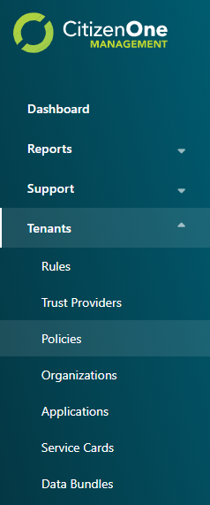

.. _viewing_policies:

Viewing All Policies
********************

The initial Policies page displays a list of all of the Policies
that have been created for your instance of CitizenOne. Here, you can see an overview of the Policy, including the name, description and the number of revisions.

From this page, you are able to filter the displayed list of Policies by their name,
click on a Policy in the list for a more detailed view, or create a new Policy.

If you have only been granted "READ" access to Policies, you will not be able to create new Policies,
nor will you be able to modify existing Policies.

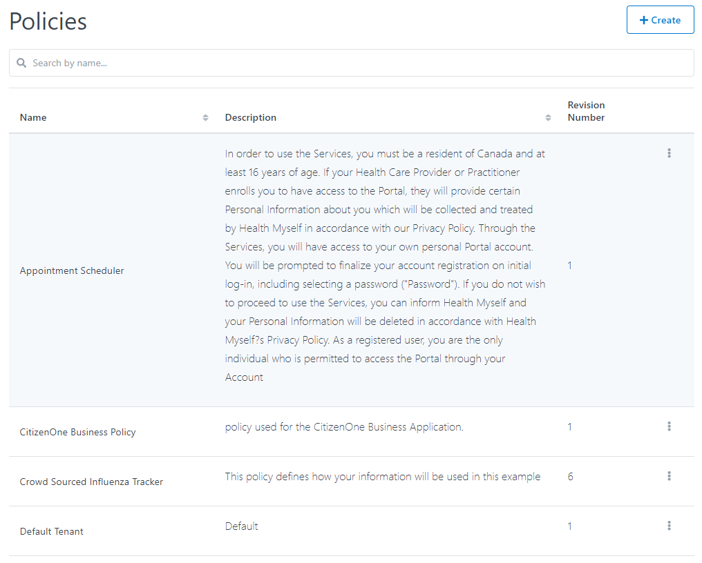

.. _creating_policies:

Creating a Policy
*****************

When you've determined that a new Policy is needed, you can click the [**+ Create**] button
in the top right of the Policies listing page.

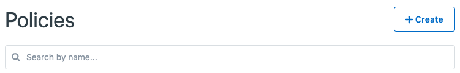

This will bring you to a new view where you will be asked to fill out only the vital information
needed to create the Policy. Any fields not seen here will be configurable after the Policy has
successfully been created.

For Policies, the required fields are:

1. **Name**: The name of the policy that will be used to set the policy on an Organization, Application, and/or Service Card.
2. **Description**: A description of the Policy to help distinguish it from other policies.
3. **RSA Public Key**: If part of this policy is to get consent to subscribe to Data Bundle changes, specify the RSA Public Key in PEM format. If this does not apply, leave blank.
4. **Default Consent Length in Days**: If you would like to set a default value for the duration in which consent is granted, specify the number of days. Citizens can override this value when consenting to the policy. If no default is required, leave the field set to 0 or blank.

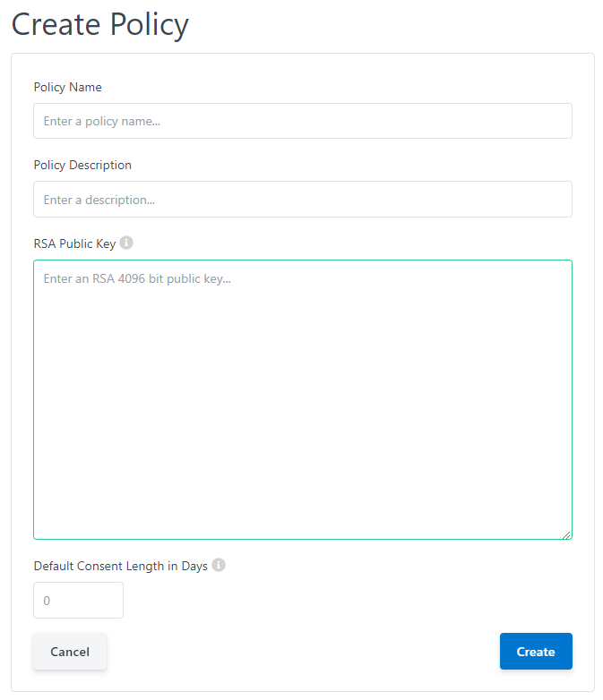

Clicking the [**Cancel**] button will not save any changes you made to the form, and you will be taken back to the
Policies listing page.

Clicking the [**Save**] button will then attempt to make a new Policy, and you will be taken
to the new Policy's details page.

.. _viewing_editing_policies:

Viewing and Editing a Policy
******************************

When you click on or create a Policy, you will be taken to a view with multiple tabs.
Each tab contains information that you can fill out to help define and customize your Policy.

Clicking on these tabs changes the view so if you are editing any forms on a page, ensure
that you save any changes, or they will be lost on navigation.

.. _policy_general:

Organization General Tab
************************

The General tab of a Policy contains the basic details that define the Policy itself.
The fields that primarily define a Policy are its Name, Description and the Default Consent Length in Days.

Clicking the [**Edit**] button will enable the fields in the view for change. Ensure your changes are saved before navigating away from the page.

.. _policy_revisions:

Policy Revisions Tab
************************

The content of a policy is contained in a Revision. This allows CitizenOne to track the revision of a policy the user has consented to and prompt the citizen for consent if a new Revision is created for a policy.

The Revisions tab of a Policy contains the history of Revisions for a policy as well as show the current active Revision.

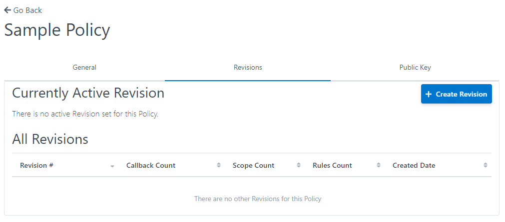

To create a new revision, click the [**+ Create Revision**] button. Creating a new Policy revision involves several steps

1. Base
~~~~~~~~~~~~~~~~~~~~~~~~

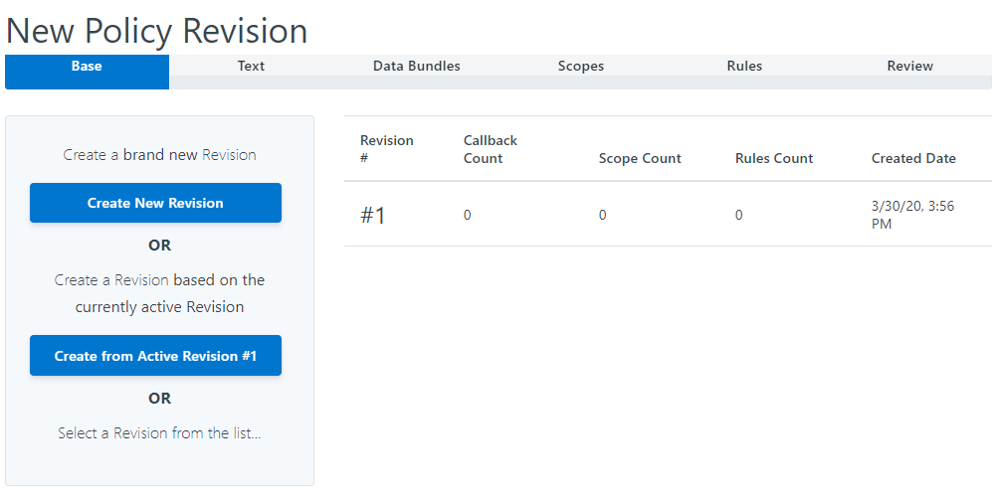

Here, we can either create an entirely new revision or use a previous revision as a starting point to base our new revision off of.

To create a new revision that isn't based on a previous revision, click the [**Create New Revision**] button.

To create a new revision based on a previous revision, click the [**Create from Active Revision**] button to base it on the currently active revision or select a revision from the list.

2. Text
~~~~~~~~~~~~~~~~~~~~~~~~

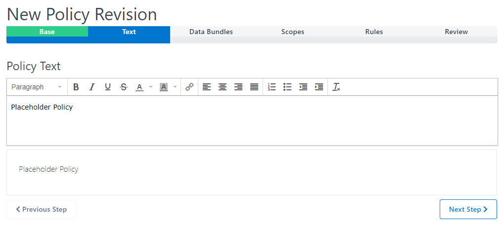

If you chose to create a new revision that isn't based on a previous revision, the Policy Text will be blank and need to be populated.

If you chose to base the new revision on a previous revision, the previous revision's text will be displayed and can be updated.

Click the [**Previous Step**] button to go back to the Base step.

Click the [**Next Step**] button to go to the Data Bundles step.

3. Data Bundles
~~~~~~~~~~~~~~~~~~~~~~~~

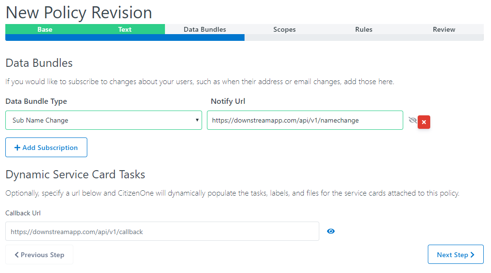

If you chose to base the new revision on a previous revision, the previous revision's Data Bundles details will be displayed and can be updated.

To add a new Data Bundle subscription, click the [**+ Add Subscription**] button. You will need to specify the Data Bundle Type the service wants to subscribe to receive changes as well as the URL of the API CitizenOne will send the Data Bundle to.

You can also specify a URL to get a set of dynamic tasks from an application for a service card. This can also populate the status of an application as well as any relevant files the application wants to present to the citizen.

Click the [**Previous Step**] button to go back to the Text step.

Click the [**Next Step**] button to go to the Scopes step.

4. Scopes
~~~~~~~~~~~~~~~~~~~~~~~~

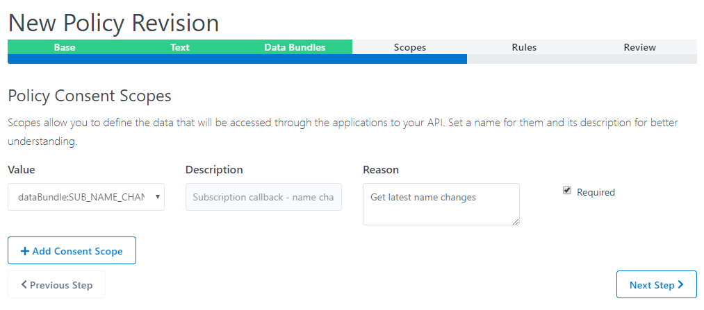

If you chose to base the new revision on a previous revision, the previous revision's Scopes details will be displayed and can be updated.

Scopes define what profile information and Data Bundles the application needs in order to use the service. Any Data Bundles defined in the previous step will automatically be added here.

To add a new scope, click the [**Add Consent Scope**] button. Select the Scope the application needs like reading the phone number ("read:phone"), the reason why the application needs this and whether the citzen is required to accept it to use the service.

Click the red [**X**] button to remove Scopes.

Click the [**Previous Step**] button to go back to the Data Bundles step.

Click the [**Next Step**] button to go to the Rules step.

5. Rules
~~~~~~~~~~~~~~~~~~~~~~~~

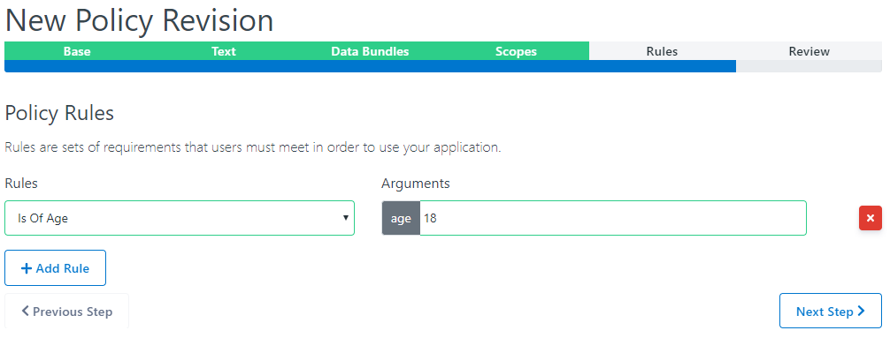

If you chose to base the new revision on a previous revision, the previous revision's Rules will be displayed and can be updated.

To add a new Rule the citizen needs to pass to use the service that has this Policy, click the [**+ Add Rule**] button. Select the Rule from the list of Rules available in your CitizenOne. If the rule has arguments, define the value that must be met.

Click the red [**X**] button to remove Rules.

Click the [**Previous Step**] button to go back to the Scopes step.

Click the [**Next Step**] button to go to the Review step.

5. Review
~~~~~~~~~~~~~~~~~~~~~~~~

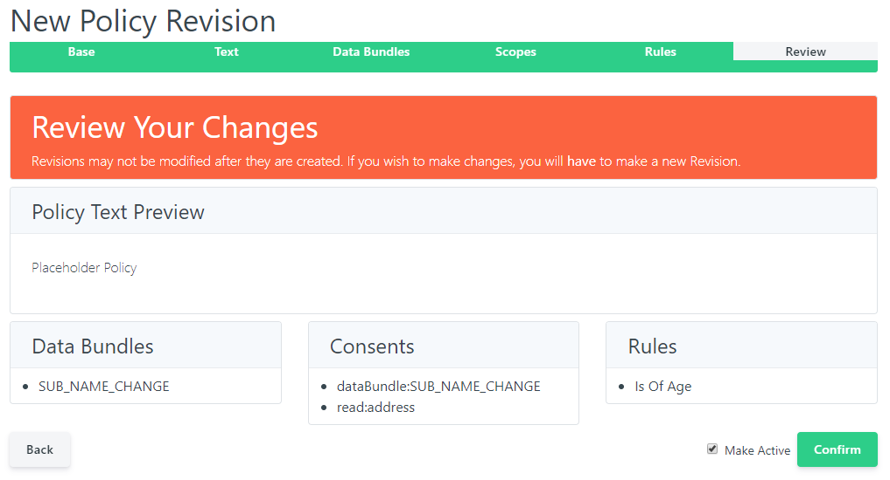

The Review step allows you to review the details of the Policy Revision before it is saved. Review the details to ensure the information is correct.

If anything needs to be corrected, click the [**Back**] button to go back to previous steps and make the necessary corrections.

Once everything is correct, click the **Make Active** checkbox if you want this Revision to be active immediately, and click the [**Confirm**] button to save the Revision.

.. _policy_revisions:

Policy Public Key Tab
************************

:ref:`Data Bundles <data-bundles-scenario-1>` enable your services to recieve updates when your user's data changes in another service. They allow your services to stay in sync without maintaining backchannel communication.

All data bundles are end-to-end encrypted and require a Public Key to subscribe to data bundles. You can follow the commands given to assist you in generating an appropriate key.

.. image:: ../images/Management/Policies/policy-public-key.png
   :width: 500pt
   :align: left

It is the responsibility of the service as a data consumer to decrypt data bundles received using the private key pair to the public key you specified.

Clicking the [**Edit**] button will enable the fields in the view for change. Ensure your changes are saved before navigating away from the page.
