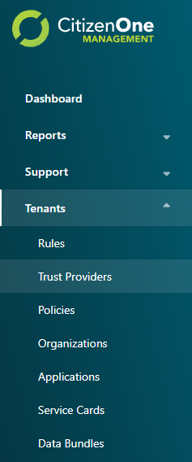
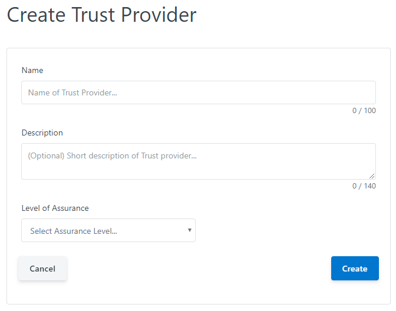
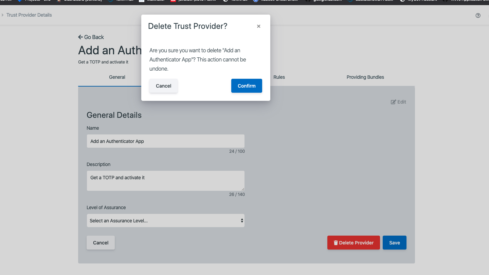

.. _provider_management:

Trust Provider Management
===================

Trust Providers are authoritative sources that can respond to requests to pass onboarding rules as well as provide :ref:`Data Bundles<data-bundles>`.

The list of all available Trust Providers can be accessed by clicking [**Trust Providers**] under the
[**Tenants**] tab of the sidebar.

.. _viewing_providers:

Viewing All Trust Providers
*************************

The initial Trust Providers page displays a list of all of the Trust Providers
that have been created for your instance of CitizenOne. 

From this page, you are able to filter the displayed list of Trust Providers by their name,
click on a Trust Provider in the list for a more detailed view, or create a new Trust Provider.

If you have only been granted "READ" access to Trust Providers, you will not be able to create new Trust Providers,
nor will you be able to modify existing Trust Providers.

.. image:: ../images/tenants/providers/initial.png
   :width: 500pt
   :alt: List of Trust Providers in CitizenOne
   :align: center

.. _creating_providers:

Creating Trust Providers
**********************************************************************

When you've determined that a new Trust Provider is needed, you can click the [**+ Create**] button
in the top right of the Trust Providers listing page.

This will bring you to a new view where you will be asked to fill out only the vital information
needed to create the Trust Provider. Any fields not seen here will be configurable after the Trust Provider has
successfully been created.

The general fields for a Trust Provider are:

1. **Name**: The name of the trust provider
2. **Description**: The optional description of the trust provider
3. **Level of Assurance**: The level of assurance this trust provider provides (https://www.tbs-sct.gc.ca/pol/doc-eng.aspx?id=30678&section=html)

Clicking the [**Cancel**] button will not save any changes you made to the form, and you will be taken back to the
Trust Provider listing page.

Clicking the [**Create**] button will then attempt to make a new Trust Provider, and you will be taken
to the new Trust Provider's details page.

.. _viewing_editing_providers:

Viewing and Editing a Trust Provider
******************************

When you click on or create a Trust Provider, you will be taken to a view with multiple tabs.
Each tab contains information that you can fill out to help define and customize your Trust Provider.

Clicking on these tabs changes the view so if you are editing any forms on a page, ensure
that you save any changes, or they will be lost on navigation.

.. _providers_general:

Trust Providers General Tab
************************

The General tab of a Trust Provider contains the basic details that define the Trust Provider itself.

..

The general fields for a Trust Provider are:

1. **Name**: The name of the trust provider
2. **Description**: The optional description of the trust provider
3. **Level of Assurance**: The level of assurance this trust provider provides (https://www.tbs-sct.gc.ca/pol/doc-eng.aspx?id=30678&section=html)

Clicking the [**Edit**] button will enable the fields in the view for change. Ensure your changes are saved before navigating away from the page.

.. _providers_onboarding:

Trust Providers Onbaording Tab
************************

The Onboarding tab of a Trust Provider specifies how CitizenOne connects to a Trust Provider to onboard a citizen.

.. image:: ../images/tenants/providers/tab/onboarding/default.png
   :width: 500pt
   :alt: Viewing onboarding information about a Trust Provider
   :align: center
..

The onboarding fields for a Trust Provider are:

1. **Base Url**: The base url for onboarding to the Trust Provider
2. **Onboarding Path**: The api path for sending the onboarding data from the form
3. **Onboarding Form**: The NoCode form for onboarding
4. **Arguments** (e.g., Argument 1, Argument 2) - Arguments to send to the onboarding form

**Note:** To add more arguments you can click the [**+ Add Argument**]
button below the last argument.

.. image:: ../images/tenants/providers/tab/onboarding/edit.png
   :width: 500pt
   :align: left
..

Clicking the [**Edit**] button will enable the fields in the view for change. Ensure your changes are saved before navigating away from the page.

.. _providers_rules:

Trust Providers Rules Tab
************************

The Rules tab of a Trust Provider specifies the Rules that this Trust Provider can fullfill.

.. image:: ../images/tenants/providers/tab/rules/default.png
   :width: 500pt
   :alt: Viewing rules information about a Trust Provider
   :align: center
..

You can assign Rules to a Trust Provider by selecting a Rule from the dropdown and entering a description.

**Note:** To add more Rules you can click the [**+ Add Rule**]
button below the last rule.

.. image:: ../images/tenants/providers/tab/rules/edit.png
   :width: 500pt
   :align: left
..

Clicking the [**Edit**] button will enable the fields in the view for change. Ensure your changes are saved before navigating away from the page.

.. _providers_bundles:

Trust Providers Providing Bundles Tab
************************

The Providing Bundles tab of a Trust Provider specifies the Data Bundles that this Trust Provider can publish to subscribing services.

..

**Notes:** 

1. If you would like to publish changes about your users, such as when their address or email changes, add those here.
2. Data Bundles are encrypted if public key is provided on the policy.
3. A more technical description can be found here: :ref:`data-bundles`.

The data bundle fields for a Trust Provider are: 

1. **Data Bundle Type**: The type of updates to push to clients. Subscribing services will reference this type.
2. **Notify Url**: The url (must be **https**) to push data bundles to.

.. image:: ../images/tenants/providers/tab/bundles/schema.png
   :width: 500pt
   :alt: Defining data bundle schema for a Trust Provider
   :align: center
..

**Notes**:

1. Clicking the [**Eye**] button will present you with the schema of the data bundle or allow you to define it if it hasn't been defined yet.
2. The notifiy url must be of type **HTTPS**.
3. Currently you can only add one bundle for a particular type.

.. image:: ../images/tenants/providers/tab/bundles/edit.png
   :width: 500pt
   :alt: Editing a data bundle for a Trust Provider
   :align: center
..

Clicking the [**Edit**] button will enable the fields in the view for change. Ensure your changes are saved before navigating away from the page.

.. _removing_providers:

Removing a Trust Provider
******************************

When you are on the General tab, click the [**Edit**] button. 

Clicking the [**Delete Provider**] button will remove the Trust Provider from CitizenOne. When deleting a Trust Provider you must accept a confirmation asking whether you want to delete the Trust Provider.
