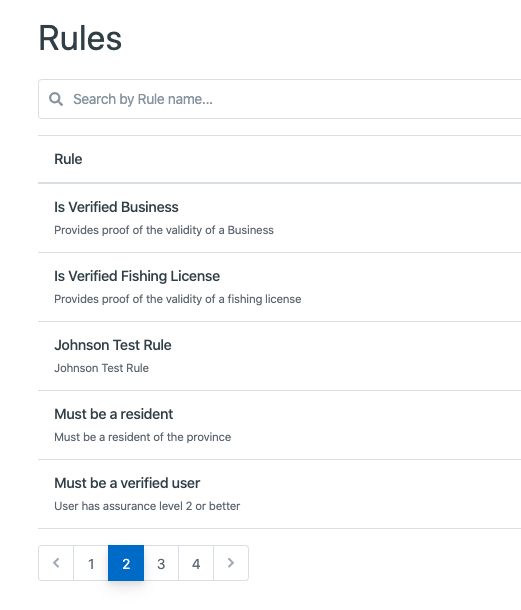
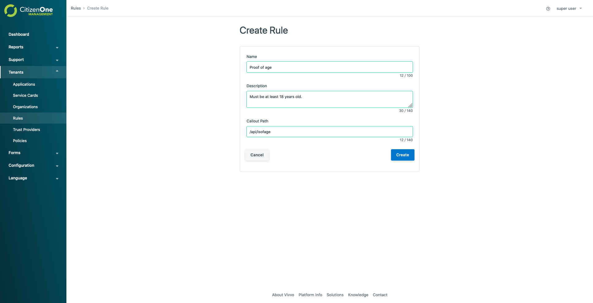
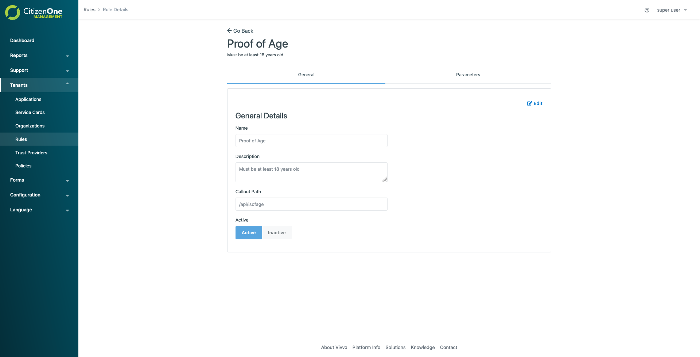
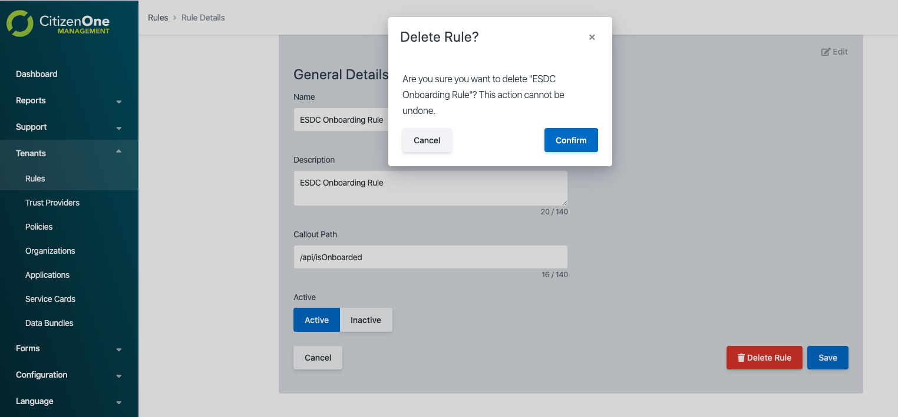

Rule Management
=======================

Rule defines for specific verification requirements and can be added onto Trust Provider or Policy. The 'Callout Path' is the api to implement the rule with 'Rule Parameters'. For example when a service card has a rule added, the rule will be checked every time launching the service card.

Creating Rules
**************

A rule can be created in Management by going to
Tenants -> Rules -> Clicking the **[Create]** button

The general fields for a rule are:

1. **Name**: The name of the rule
2. **Description**: The optional description of the rule
3. **Callout Path**: the api path for implementing the rule

Editing Rules
******************************************************************************************************

Editing Rule can be done in Management under:
*Tenants -> Rules ->* Clicking the *Rule*

**Note:** You must click **[Edit]** in order to edit a
Rule in each tab.

  .. image:: ../images/rule-edit.png
     :width: 500pt
     :align: left
  ..

The general fields for a rule are:

1. **Name**: The name of the rule
2. **Description**: The optional description of the rule
3. **Callout Path**: The rule's callout path

Deleting Rules
*************************

Deleting a rule can be done by going to the **[General]** tab, clicking **[Edit]**, then clicking **[Delete Rule]**.
When deleting a rule you must accept a confirmation box asking you whether you want to delete the rule.

