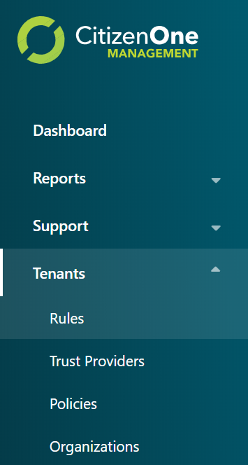
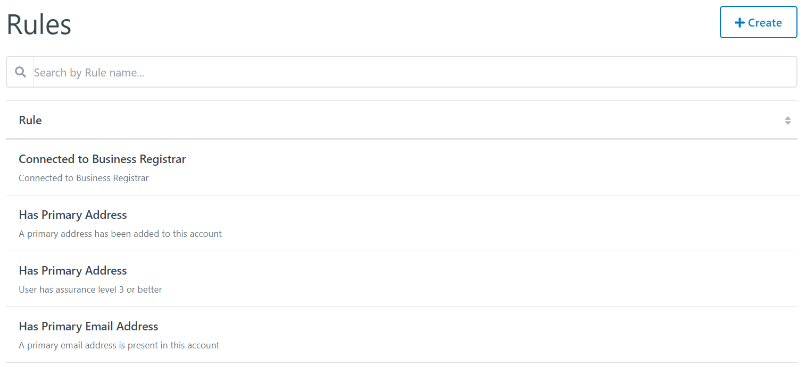
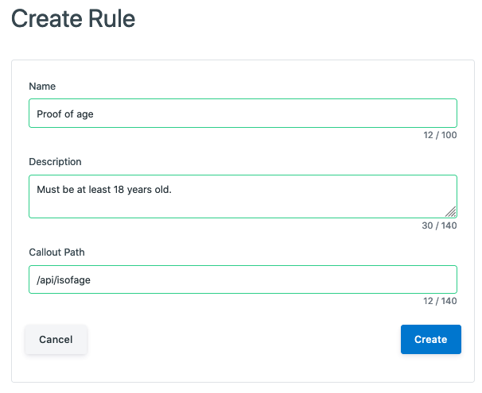
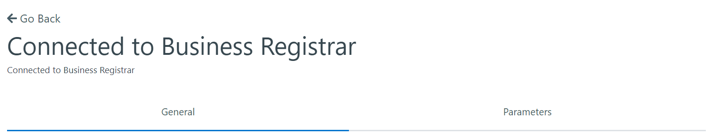
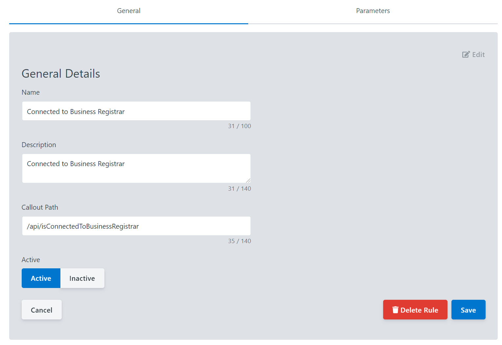

.. _rule_management:

Rule Management
=======================

Rules define a specific verification requirement and can be added to Trust Providers or Policies. 

The list of all available Rules can be accessed by clicking [**Rules**] under the
[**Tenants**] tab of the sidebar.

.. _viewing_rules:

Viewing All Rules
*************************

The initial Rules page displays a list of all of the Rules that have been created for your instance of CitizenOne. 

From this page, you are able to filter the displayed list of Rules by their name,
click on a Rule in the list for a more detailed view, or create a new Rule.

If you have only been granted "READ" access to Rules, you will not be able to create new Rules,
nor will you be able to modify existing Rules.

.. _creating_rules:

Creating Rules
**************

A rule can be created in Management by clicking the [**+ Create**] button

The general fields for a Rule are:

1. **Name**: The name of the rule
2. **Description**: The optional description of the rule
3. **Callout Path**: The api path for implementing the rule

Clicking [**Cancel**] will not save any changes you made to the form, and you will be taken back to the
Rules listing page.

Clicking [**Save**] will attempt to make a new Rule and you will be taken
to the Rule listings page.

.. _viewing_editing_rules:

Viewing and Editing a Rule
******************************

When you click on a Rule, you will be taken to a view with multiple tabs.
Each tab contains information that you can fill out to help define and customize your Rules.

Clicking on these tabs changes the view so if you are editing any forms on a page, ensure
that you save any changes, or they will be lost on navigation.

.. _rules_general:

Rules General Tab
************************

The General tab of a Rule contains the basic details that define the Rule itself.
The three fields that primarily define a Rule are its Name, Description and the Callout Path.

  .. image:: ../images/Management/Rules/rule-create-general.png
     :width: 500pt
     :alt: Viewing general information about a Rule
     :align: center
  ..

The general fields for a Rule are:

1. **Name**: The name of the rule
2. **Description**: The optional description of the rule
3. **Callout Path**: The api path for implementing the rule

Clicking [*Edit*] will enable the fields in the view for change. Ensure your changes are saved before navigating away from the page.

.. _rules_parameters:

Rules Parameters Tab
************************

The Parameters tab of a Rule contains optional parameters that can be set when added to a Policy.

  .. image:: ../images/Management/Rules/rule-create-parameters.png
     :width: 500pt
     :alt: Viewing parameter information about a Rule
     :align: center
  ..

Clicking [*Edit*] will enable the fields in the view for change. Ensure your changes are saved before navigating away from the page.

  .. image:: ../images/Management/Rules/rule-parameter-edit.png
     :width: 500pt
     :alt: Editing parameter information about a Rule
     :align: center
  ..

New Parameters can be added while in Edit mode by clicking the [**+ Add Parameter**] button. The only field required for a Parameter is the Name.

Parameters can also be removed while in Edit mode by clicking the [**X**] button next to a Parameter.

.. _removing_rules:

Removing a Rule
******************************

When you are on the General tab, click the [**Edit**] button. 

Clicking the [**Delete Rule**] button will remove the Rule from CitizenOne. When deleting a Rule you must accept a confirmation asking whether you want to delete the Rule.
