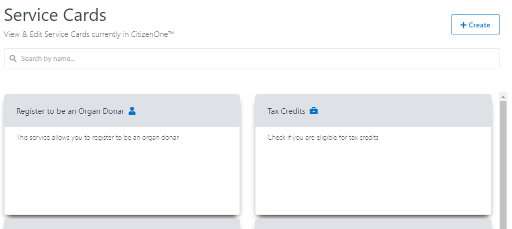
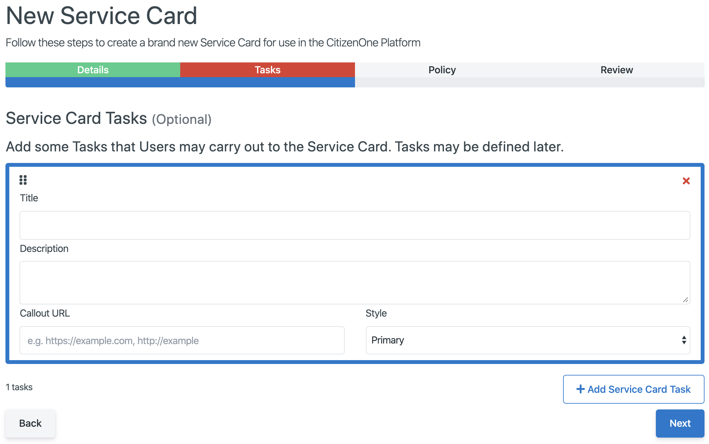

.. _service-card-management:

Service Card Management
=======================

Introduction to the Service Cards Management tab.

Viewing Service Cards
**************

You will be able to view a list of service cards in Management by going to
Tenants -> Service Cards

Creating Service Cards
**************

A service card is able to be created in Management by going to
Tenants -> Service Cards -> Clicking the **[Create]** button

The tabs for a service card are:
**Details**: The basic information of service card
**Tasks**: The tasks of the service card 
**Policy**: The policy of the serviec card
**Review**: Reviewing all service card information before creating

Service Card Details
~~~~~~~~~~~~~~~~~~~~~~~~~~

The general fields for the details of service card are:

1. **Title**: The title of the service card
2. **Service Card Type**: The type of service card
3. **Description**: It's optional to describe the service card
4. **Pilot**: Pilot Mode will remove the service card from the service catalog, but remain available through direct access.

.. image:: ../images/tenants/serviceCards/servicecard-create-details.png
   :width: 500pt
   :align: left

Service Card Policy
~~~~~~~~~~~~~~~~~~~~~~~~~~

The policy of service card is optional, user must consent to upon first use of the Service Card, a Policy may be applied later, as well.

.. image:: ../images/tenants/serviceCards/servicecard-create-policy.png
   :width: 500pt
   :align: left

Service Card Review
~~~~~~~~~~~~~~~~~~~~~~~~~~

The service card review tab will show all service card information including basic details, pilot mode, tasks and policy, if you have any concerns about the information, just clicking the 'back' button, if all information are correct, by clicking the 'confirm' button you will create a new servic card.

.. image:: ../images/tenants/serviceCards/servicecard-create-review.png
   :width: 500pt
   :align: left

Service Card Tasks
******************

Adding a Service Card Task
~~~~~~~~~~~~~~~~~~~~~~~~~~

A service card task can be created in Management by going to
Tenants -> Service Card -> Tasks -> Clicking the **[Add Service Card Task]** button ->

The general fields for a task are:

1. **Title**: The title of the service card task
2. **Description**: The optional description
3. **Callout URL**: the api path for implementing the service card
4. **Style**: The service card background color, 'Primary', 'Second', 'Danger', 'Warning' and 'info'

Reordering Service Card Tasks
~~~~~~~~~~~~~~~~~~~~~~~~~~~~~
The service card tasks are able to be re-ordered through draging the task.

image:: ../images/tenants/serviceCards/servicecard-tasks-reordering.png
   :width: 500pt
   :align: left

Removing Service Card Tasks
~~~~~~~~~~~~~~~~~~~~~~~~~~~

You have to find the service card in Management by going to Tenants -> Service Card, then open the service card and click the tasks tab. you can remove the service card task by clicking the red close button on right top corner.

image:: ../images/tenants/serviceCards/servicecard-tasks-remove.png
   :width: 500pt
   :align: left

Extra Service Card Details
*****************************************

Contacts
~~~~~~~~
The contacts tab allows you to add relevant contact information to the service card. You can specify information for one or more contacts using the fields shown.

  .. image:: ../images/tenants/serviceCards/contact-information.png
     :width: 500pt
     :align: left
  ..

The contact information entered will be shown on the back of the service card.

  .. image:: ../images/tenants/serviceCards/service-card-contacts.png
     :width: 500pt
     :align: left
  ..

Linking Forms to Service Cards
*****************************************

You can link a form to a service card causing the form launch as submission to appear as a task on the service card. Form responses you ahve already submitted will appear as separate actions below that.

  .. image:: ../images/tenants/serviceCards/service-card-form-action.png
     :width: 500pt
     :align: left
  ..

The form will display when you click the "Launch <Form Name>" action and can be filled out and submitted. 

  .. image:: ../images/tenants/serviceCards/service-card-form.png
     :width: 500pt
     :align: left
  ..

In order to link a form to a service card you need to:

1. Make sure the service card is :ref:`connected to an aplication<application_service_cards>`.
2. Make sure that the service card :ref:`application has a policy<application_policy>`. 
3. :ref:`Create a form<creating_forms>` in the same organization and application that is linked to the service card.
4. Navigate to the Form tab for your service card and select the form from the list.
  
  .. image:: ../images/tenants/serviceCards/service-card-form-management.png
     :width: 500pt
     :align: left
  ..

Linking Service Cards to Applications
*****************************************

You can view which applications are attached to a service card in the last tab of the service card editor.

  .. image:: ../images/tenants/serviceCards/applications.png
     :width: 500pt
     :align: left
  ..

You cannot link or unlink applications from service cards on this screen. However, if you click the highlighted "click here" text it will take you to the applications screen where you can add or remove service cards to applications.
For more details see the :ref:`application_service_cards`.