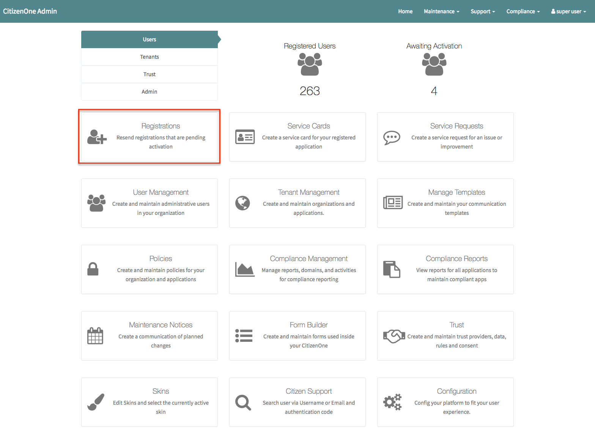
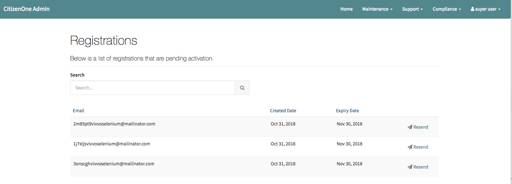
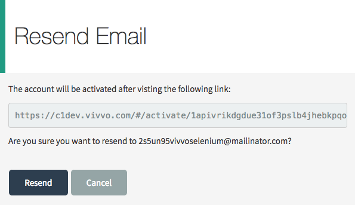

Registration
============
Sometimes activation urls can get lost, dropped or spammed.  Email is a best effort service on the internet, and sometimes helpdesk personel need to be empowered to assist users.

Assisting users during registration
***********************************
- Click the management tile on the CitizenOne DashBoard

- Review the user list and select the user that requires assistance

- Select the resend link to view the activation URL

- A form will be presented that allows you to view and optionally resend the activation link

