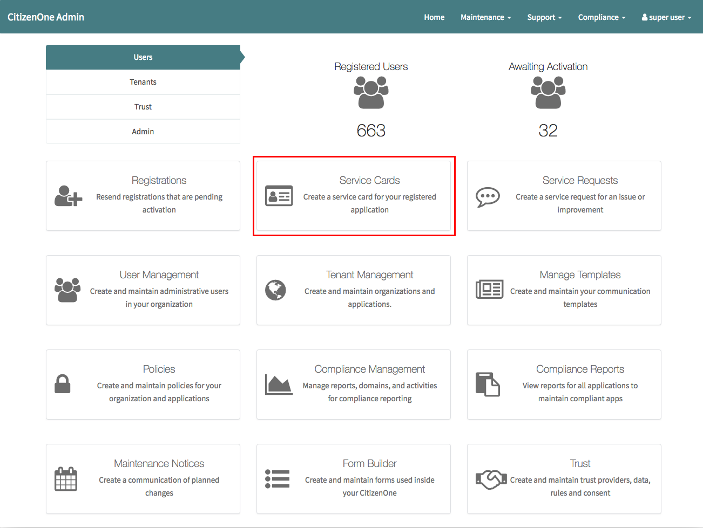
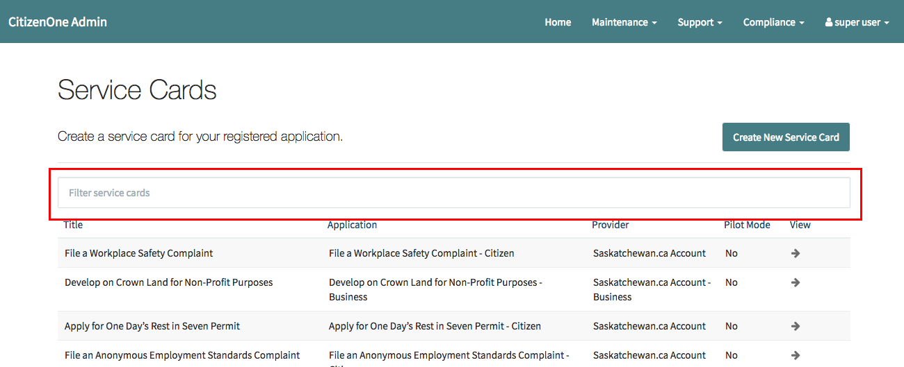
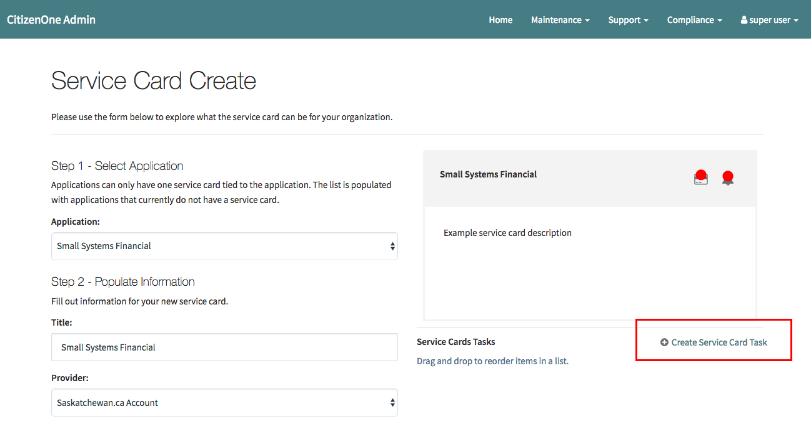
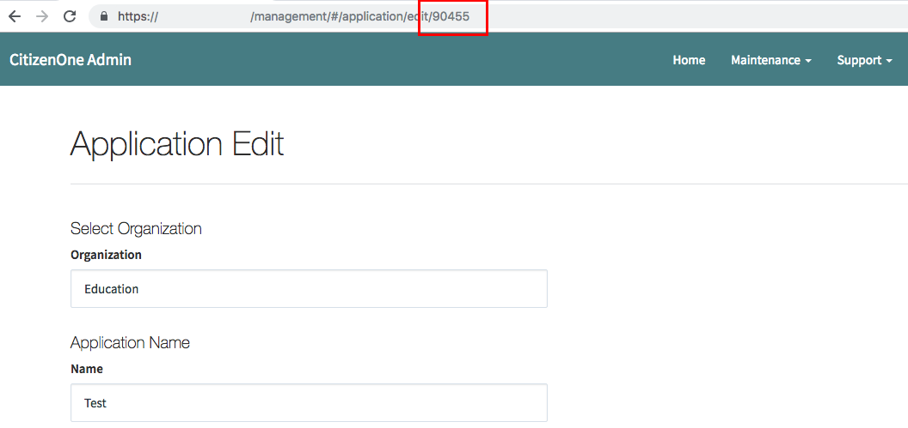
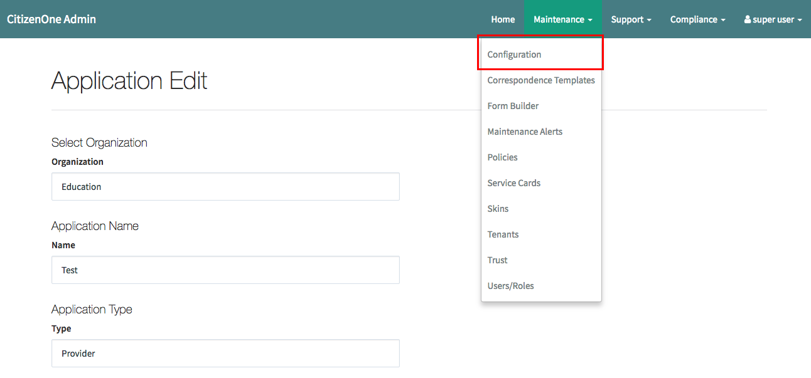
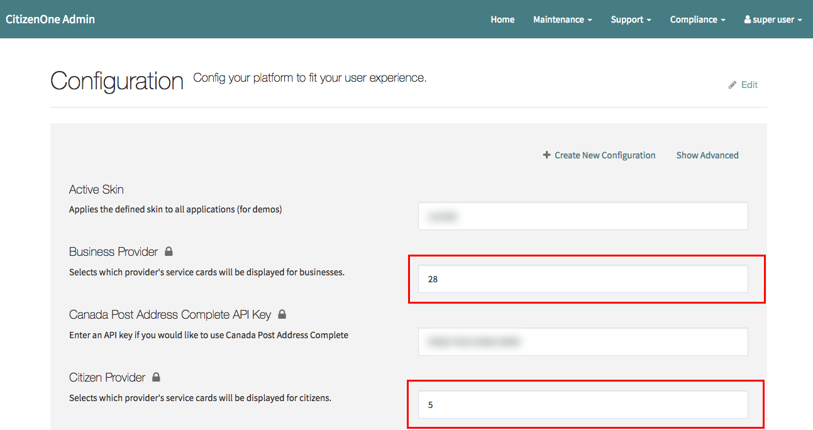

.. _service-card-management:

Service Card Management
=======================

//TODO: Description

Viewing Service Cards
*********************

- From the management dashboard, select the "Service Cards" tile.

- You will be presented with a list of service cards.  You can filter service cards by beginning to type any of the following fields:

    - Title
    - Application name 
    - Provider

What Are Relying Parties? Providers?
************************************

- CitizenOne identifies two types of applications.

    - **Providers** are applications which offer one or more services through their dashboard. Service cards owned by one provider will only be visible for that provider's users (e.g. The Government of Saskatchewan)

    - **Relying Parties** are downstream applications offered as services by providers (e.g. Apply for a Student Loan)

Creating Service Cards
**********************

- From the Service Cards page, select the "Create New Service Card" button

// TODO: Picture

Step 1
~~~~~~

- Select an application for which the service card is to be tied to from the application select box.  

.. note::
    Only applications of relying parties that do not currently have a service card will be available for selection.

// TODO: Picture

Step 2
~~~~~~

- Fill out the name & description of your service card.  This information will be visible to your users from their dashboard and from the service card details page.

- Select a provider for this service card.  A provider defines where the service card will be visible to your users (e.g. Business Connect)

// TODO: Better description?

- Specify how a service card may be interacted with from the service card dashboard

    - **No** indicates the service card is available to be added by a user from their dashboard

    - **Yes** indicates the service card is not availble to be added by a user directly from their dashboard

Step 3
~~~~~~

- If applicable, attach a form to be used when onboarding the service card for your users.

// TODO: Picture

Service Card Tasks
******************

- A service card task is one or more links related to the service card.  These can be, but are not limited to, links to the downstream service or documentation on how to use the service.

Adding a Service Card Task
~~~~~~~~~~~~~~~~~~~~~~~~~~

- To create a new service card task select the "Create Service Card Task" button below the service card preview

- Give the task a title and description.  These will be displayed to your users on the service card's details page under "Tasks"

- Specify the URL to go to when a user clicks on the task.

- Select "Create Service Card Task" to save the task

Reordering Service Card Tasks
~~~~~~~~~~~~~~~~~~~~~~~~~~~~~

- When there are more than one tasks on a service card, the tasks may be reordered by clicking and dragging the task into the desired order.

// TODO: Gif

Removing Service Card Tasks
~~~~~~~~~~~~~~~~~~~~~~~~~~~

- To remove a service card task, click the X on the task.

.. warning::
    Be sure you want to remove the task.  This cannot be undone.

Managing What Service Cards Are Displayed
*****************************************

By default, every instance of CitizenOne is initialized with two providers; One for citizens and one for businesses. Service cards added to the citizen provider will only be visible to citizens in the citizen dashboard, whereas service cards added to the business provider will only be available to businesses through the business dashboard.

Changing the Default Providers
~~~~~~~~~~~~~~~~~~~~~~~~~~~~~~

- Create a provider application following the steps outlined in :ref:`Tenant Management<tenant-management>`

- After creating a new provider application go to the "Application Edit" page, note the application ID in the URL

- Go to the "Configuration" page 

- Select the "Edit" option to enable the configuration inputs

- To update the citizen service card provider, update the "Citizen Provider" field with the application ID noted earlier.
- To update the business service card provider, update the "Business Provider" instead.

- Be sure to save your changes by pressing the "Save" button at the bottom of the page.  

.. note::
    Your changes may take up to 5 minutes to be reflected within the citizen and business applications.