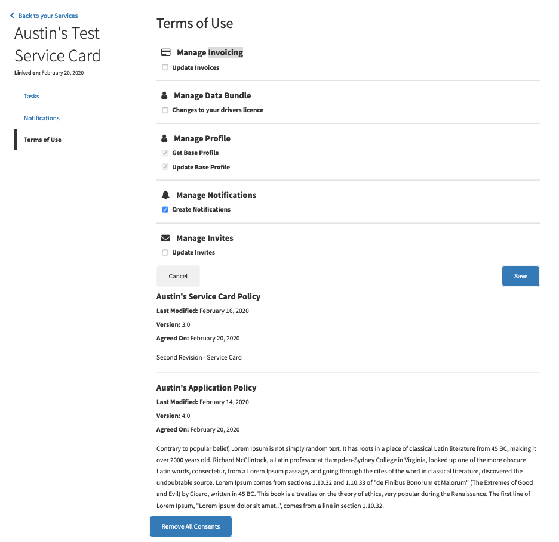
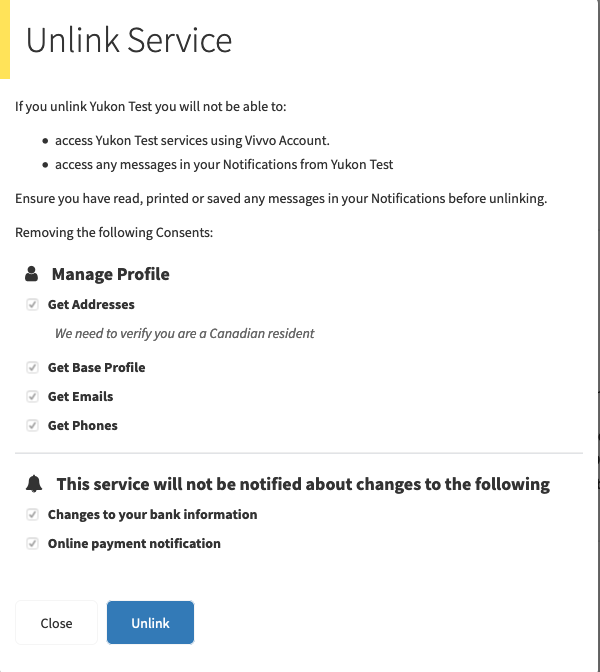

.. _consents:

Consents
========

We updated the 'terms of use' page on the back of the service card to show scopes, consents and policies in hierarchy, to modify the optional scopes, and to un-link consents. It was implemented on both portal and business.

Terms of Use
~~~~~~~~~~~~
The 'Terms of Use' page will load all of the scopes, consents and policies base on service card and identity. The optional consent scopes are able to be checked or un-checked, the 'Save' button will appear automatically when any changes. Going through all the consent scopes, then checking or un-checking the optional scopes, after that clicking the save button to save the changes. The 'Cancel' button will disappear the two buttons 'Cancel' and 'Save', and not save an changes for checking and un-checking the consent scopes!

The policies for this service card are also listed on the page with information like Policy Name, Last Modified, Version and the content of Policy.

Remove All Consents
~~~~~~~~~~~~~~~~~~~

The Button 'Remove All Consents' at the bottom of the page 'Terms of Use' is working for un-linking all the consents. A new page 'Unlink Service' responding for the button click is designed for showing all consented scopes for reminding before confirming removing all consents. The consented scopes in this page include the required scopes for the service card and checked optional scopes, so the un-checked optional scopes will not show in this page.

