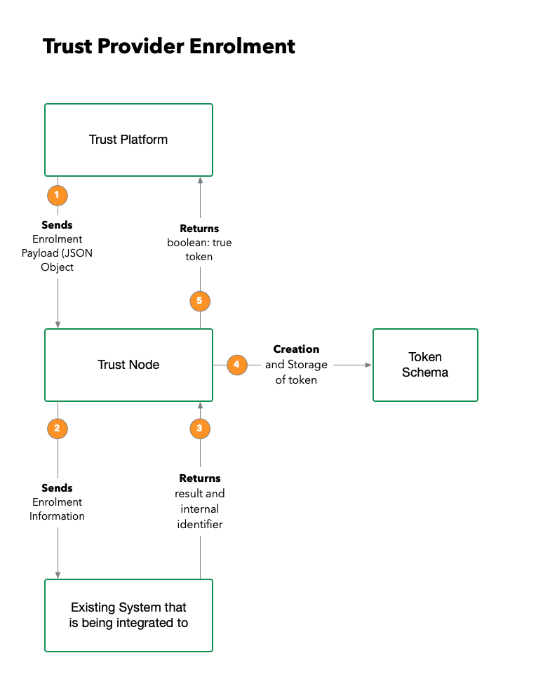
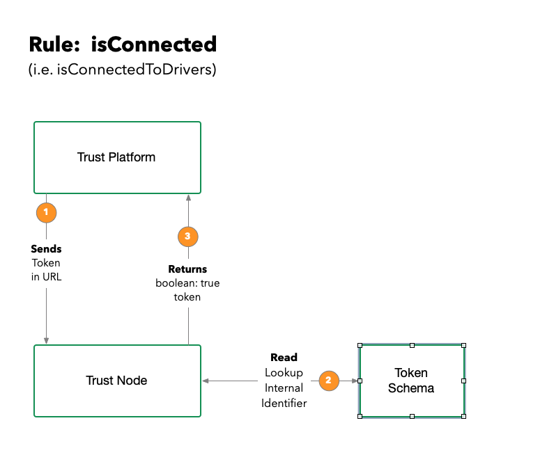
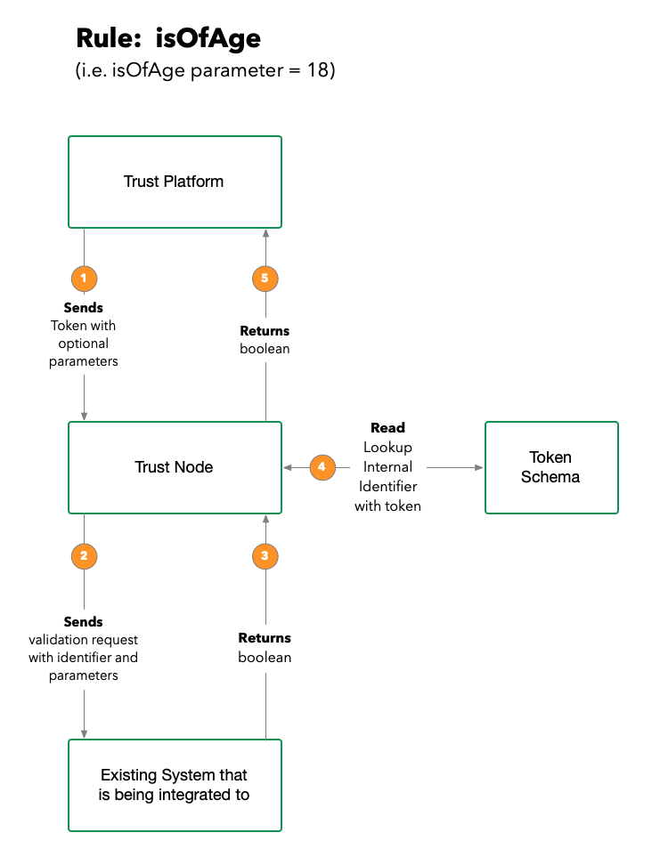

Integration into the Trust Platform
====================================

Glossary
********

Token 
    A token is a representation of a relationship between entities.  This can be a MUN (Meaningless Unique Identifier) of something more significant such as a verified credential.
    
Trust Node
    A trust node is a seperate application that exists out side of the Trust Platform, that represents the integration edge to client systems.

Trust Platform
    The SAAS components that represents the workflows that faciitate data brokering.  The interface to the trust platform is an API gateway.

Verified credential
    The JSON representation of verified state, provable from both parties. (issuer and holder).

Verified Interaction
    This refers to the trust rule in the platform that allows a tenant administrator to create rules to protect:
    
    - Access to services
    - Access to areas of a website
    - enablements for login
    - Enablements for registration

    During the evaluation of the rule, a trust node is consulted to authorize the interaction. (e.g. user must be connected as a verified driver)

Introduction
*************

The Trust Node is a SDK that allows an integrator to build a interface with a client line 
of business to enable that line of business to authorize approved individuals.  This approval allows the 
integration to perform actions like:

- Enroll the user using known attributes that the business can qualify
- Answer questions about the user (i.e. "has the user paid for a membership" or are they "18 years or older"
- Evaluate verified credentials
- issue verified credentials
- Share peer to peer encrypted citizen information with other lines of business with user consent
- Access user information with consent
- Revoke credentials 
- list services 

The list above are all capabilities of the SDK, and this accelerator allows an integrator to rapidly build integrations.

Enrollment 
**********

Enrollment is the workflow that is performed when a user is connected to a integration point with the clients infrastructure.

The example we will use for this explanation is a service that requires a verified user that is 18 years of age or older.

**Existing Connected Users**

1.  When the user selects to use this service, the trust platform will look to see if they have a connected trust node that can evaluate both a "verified user" and "if they are 18 or older"
2.  If the system finds tokens for both rules, it will use that token to ask the trust nodes to broker a realtime evaluation and return the results
3.  If the result from either request comes back false, the user cannot use the service and an explanation is displayed why.
4.  It both results return true, the the user can now user the service.

**No Existing Connection that can fullfill the rule evaluation**

1.  When the user selects to use this service, the trust platform will look to see if they have a connected trust node that can evaluate both a "verified user" and "if they are 18 or older"
2.  The system cannot find a conenction that can broker this requests and returns to the UX a list of trust providers that can satisfy these verifications.
3.  The user selects a trust provider that they are familar with, and a form to collect the attributes required so that the Trust node can connect their account to the platform user account.
4.  The Trust node will use these use filled attributes values, and send them to the clients line of business to verify it is correct.
5.  If the business, based on it's business rules agree that this is the correct information it will return an internal identifier and a boolean true back to the Trust node.
6.  The Trust node will create a token to represent this connection and store it and its association with the internal identifier in an accessible data source.
7.  The Trust node returns a true and token back to the Trust platform, for the platform to associate the user with this connection
8.  Teh token is used going forward to answer questions like "isVerified"

Rule Evaluation
***************

Now that the platform has an association with the Trust Node in the form of a token, it can now ask questions, that the Trust Node is 
programmed to answer such as (for example:  isOfAge or LegalNameVerified).

The token is used to abstract the actual protected identifier in the client system, stored in the Trust Nodes datastore. 

   
