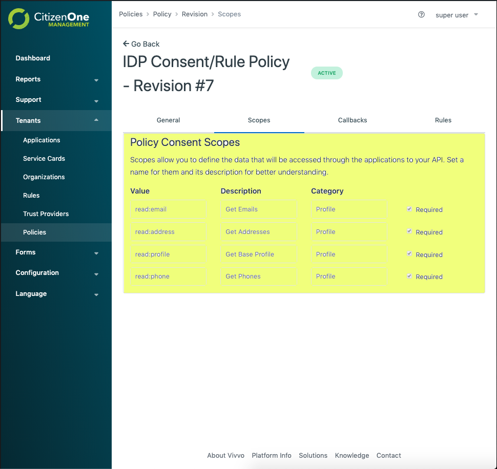

OpenID Connect (OIDC)
=====================

CitizenOne™ as an Identity Provider (IdP)
*****************************************

CitizenOne™ is ready out of the box to provide OIDC federation. To use CitizenOne™ as an IdP you need to configure an application and service card and attach a policy. Please refer to :ref:`createServiceCard` for more information.

We have published a very simple NodeJS application that you can use to test your OIDC configuration: `Passport OIDC Example <https://github.com/Vivvo/passport-oidc-example>`_.

The Passport OIDC Example application requires the following configuration. This is fairly standard configuration for an OIDC Relying Party.

.. code-block:: JSON

    {
        issuer: 'https://{{CITIZEN_ONE_DOMAIN}}/',
        authorizationURL: 'https://{{CITIZEN_ONE_DOMAIN}}/oauth/v2/authorize',
        tokenURL: 'https://{{CITIZEN_ONE_DOMAIN}}/oauth/v2/token',
        userInfoURL: 'https://{{CITIZEN_ONE_DOMAIN}}/oauth/v2/userinfo',
        clientID: '41209adf-45e9-4d1b-8720-8c6a1e680ceb',
        clientSecret: 'd18a3ba5-e7be-4da6-857d-333e5cf6e794',
        callbackURL: 'https://{{RELYING_PARTY_CALLBACK_URL}}',
        scope: 'openid profile email phone address'
    }

The URLs that contain {{CITIZEN_ONE_DOMAIN}} (**issuer, authorizationURL, and tokenURL**) will be consistent across all instances of CitizenOne™ - just inject your CitizenOne™ domain.

The **clientID** and **clientSecret** are generated by CitizenOne™ and can be found in the application section in the management application. The clientID is like your application's username while the clientSecret is like your application's password. Since it is like a password, we only store a hashed version of it and cannot recover it for you. You can generate a new one at any time in the management application. Please note that generating a new clientSecret will immediately invalidate the old one.

.. image:: ../images/application-credentials.png
   :width: 500pt
   :align: left

The **callbackURL** comes from your relying party and must be configured as a "Redirect URL" for the application in the management application.

The **scopes** that are available to your Relying Party application are the consent scopes that are attached to the policy attached to your application, organization and/or tenant:

CitizenOne™ as a Relying Party (RP)
***********************************

It is possible to configure CitizenOne™ as an OIDC relying party to an external IdP however this is not currently possible through the management application. To configure your IdP we will need the following data:

- **issuer** - the issuer identifier for your IdP. OIDC supports multiple Issuers per Host and Port combination. The issuer configured MUST exactly match the value of **iss** in the ID Token.
- **clientID** - the client id CitizenOne™ will use to make requests to your IdP
- **clientSecret** - the client secret CitizenOne™ will use to make requests to your IdP
- **scope** - the scopes that we should request - this will impact what data gets populated in the user's CitizenOne™ profile after successfully authenticating
- **authorizationURL** - your IdP's `authorization URL <https://openid.net/specs/openid-connect-core-1_0.html#AuthorizationEndpoint>`_
- **tokenURL** - your IdP's `token URL <https://openid.net/specs/openid-connect-core-1_0.html#TokenEndpoint>`_
- **userInfoURL** - your IdP's `userinfo URL <https://openid.net/specs/openid-connect-core-1_0.html#UserInfo>`_
