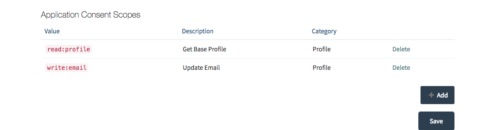

Tenant Management
=================

CitizenOne is a multi-tenant capable platform, that allows you to create organizations that can be insulated from other organizations, or share with other organizations.  Inside organizations, application providers can becreate that begin to inherit policy from the parents. 

Viewing Organizations
*********************

- From the management dashboard, select the "Tenant Management" tile.

- You will be presented with a list of applications and organizations.  You can filter applications by selecting the organization to filter with in the filter select box.

Creating Organizations
**********************

- From the tenant management dashboard select the create organization button

- Give your organization a good common name, and select save.

.. image:: images/create-org2.png
   :width: 200pt

- You will now see your newly created organization in the list.  If you select Edit you change the name and/or add privacy scope.

What is Privacy scope
-------------------------

Every user in CitizenOne has a GUID (36 character randomized string) that identifies them uniquely within the CitizenOne namespace.  There are three types of scope:

**Global Scope**

Global scope uses the same identifier for all applications and organizations in the CitizenOne namespace.  The GUID representation of the user is the same for all, and can be used to correlate data accross the entire namespace.  This is a great option if all service providers using the system are trusted and your policy states that global consent when signing up entitles all participants to potentially have access to your identifier without consent.

**Organization Scope**

Organization scope creates unique identifier for all users under that organization.  If two organizations have privacy scope enabled, they will not be able to correlate users without the users consent.  The CitizenOne privacy proxy allows organizations to connect the same user - but only when user consent is in place.  A user at any point can choose to unlink from an organization, and all future profile requests will be denied.  If the user chooses to re-link your organization, the original GUID is re-established so you can retain business continuity.

**Application Scope**

Application scope is similar to organization scope, except that all applications inside an organization are insulated from the ability to correlate user information without consent in place for each application.  This is great when privacy is of the upmost importance.  An example would be a social service organization, where the lines of business need to respect user consent.

- By selecting privacy scope, be warned that this will reset all identifiers in that organization and expose a new organization scoped GUID that is unique to that organization only. This decision to enable privacy scope or not, should be decided when the organization is created.  Deciding later, after users are registered, will reset their identifiers and break business continuity.

Creating Applications
*********************

- To create a new application select the "+ Create Application " from the top area of the tenant dashboard.

- Select which organization you are creating the application under.
- Give your application a common name.

- You will now be able to view the client secret and client Id for this application.  These keys are required as the application credentials to use the api CitizenOne gateway. The secret key can only be viewed once, so copy this to a safe place.  If you loose your key, you only have the ability to generate a new one.

- After you have copied your keys, continue to the next section.
- On the next section we have the ability to change names, regenerate keys, whitelist URL's (for redirection and oauth2 flows) and enable/disable privacy scope (again, caution here - this should be thought out on creation).

- The next section on the page allows you to select a privacy policy that you previously created in the policy section.  If you do not select a policy the organization policy will be inherited.

- In the rule section you can select which rules have to be passed to use the service.
- To add a rule select the "+ Add " button, in the rule section.

.. image:: images/application-create5.png
   :width: 400pt

- Rules are setup in the trust provider section.  CitizenOne's flexible trust network allows you to connect to authoritative and qualifing providers to build trust gates to your application
- Pick a rule from the list 
- Notes:  You will notice that we ask for rule qualifiers, but do not expose where the rule is evaluated.  This blinding of the source keeps the user private, by showing the application that they have passed the rule, but blind the source.

- Add an application call back.  
- **Notes** Application call backs allow your application to interoperate with the application via our REST api.  Call backs you can configure are:

1.  Subscribe to name changes

When the users name changes, CitizenOne writes this event to the url that your specify.  Please refer to the api reference at https://c1-api.vivvo.com 

2.  Subscribe to address changes

When the users address changes, CitizenOne writes this event to the url that your specify.  Please refer to the api reference at https://c1-api.vivvo.com 

3.  Subscibe to phone changes

When the users phone number changes, CitizenOne writes this event to the url that your specify.  Please refer to the api reference at https://c1-api.vivvo.com 

4.  Subscribe to email changes

When the users email changes, CitizenOne writes this event to the url that your specify.  Please refer to the api reference at https://c1-api.vivvo.com 

5.  Online payment call back

If you are using the CitizenOne payment broker, Citizenone will send payment processing information from the payment processor to your payment api.  Please refer to the api reference at https://c1-api.vivvo.com

6.  Application get status service

The get status service is a service that CitizenOne calls out to, to ask the application to provide contextual things to display on the behalf of the application.  This gives the service card the ability to display things such as links to the application based on the state of the user (i.e. Apply now, Renew Now, Re-apply now based on the users context).  This service card interaction can also display files that the user can download (e.g. a certificate or permit that was purchased).

- Lastly on this page, you can select which authorization scopes you wish to enable.  This ties into the consent engine, where we explicity ask the user for specific minimum permissions to use the service. 

