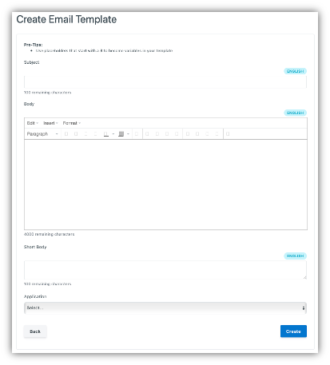

.. _Email-templates:

Email Templates
#################

Email Templates allow for correspondence with the citizens to have the same look and feel across the platform through consistent branding. The contents of the template and how it gets populated can be managed by the :ref:`Organizations <organizations>` or the :ref:`Tenants <tenants>`.

The list of all email templates created on your instance of the Vivvo Trust Platform can be accessed by clicking **Email Templates** under the **Support** tab of the sidebar. To create a new email template, click on [**+Create**] then follow the steps below:

*  In the **Subject** field, type in your message heading
*	For emails, type the message in the **Body** field, and for SMS, type the message in the **Short Body** field.
*	Select the service that will send the message in the **Application** dropdown list.
*	Click on [**Create**].
*	Verify that the template has been created by searching for it in the **Search** bar at the top of the page.

It is also possible to create context specific messages with variables and media like photos and videos in the notification templates. To add variables to your templates, simply use placeholders starting with $, for example,

|   Hi $firstName $lastName,
|    
|   Your application has been approved.

The Body field on the Create Email Template page also features a rich text editor which allows the addition of links, tables images, videos and more to the templates. 

