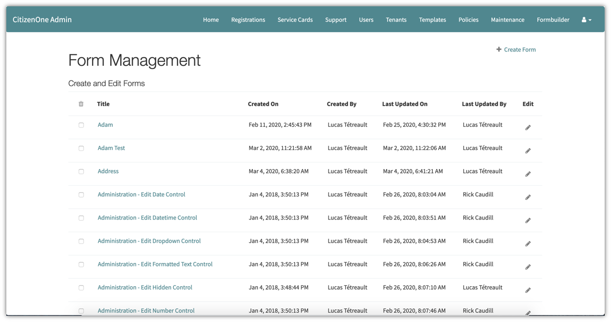
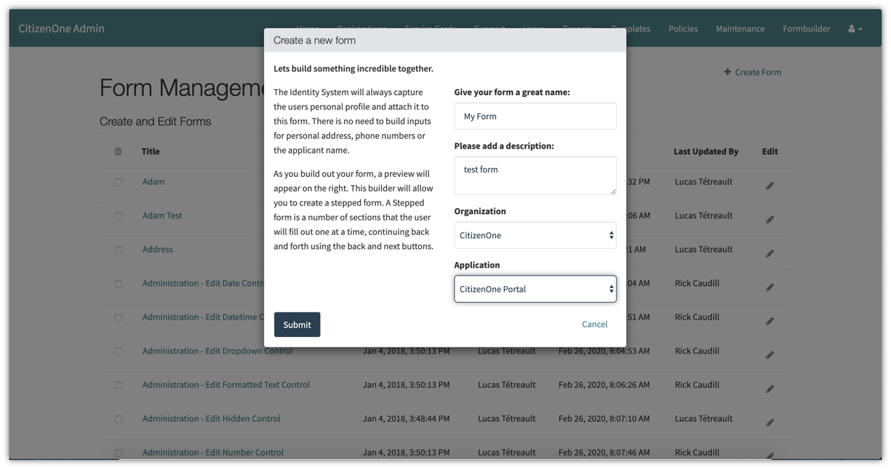
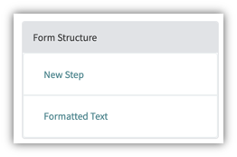
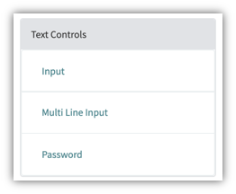
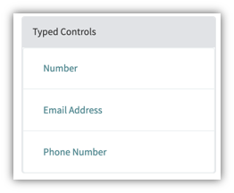
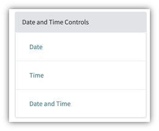
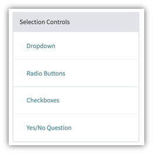
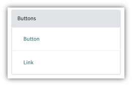
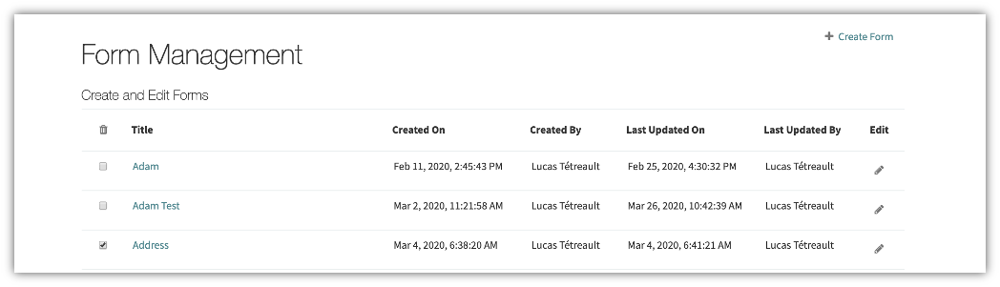

.. _forms:

Forms
#####

Vivvo Trust Platform features a robust No-Code Form Builder that allows forms to be created without the need to write and deploy code. This allows for the creation of data in-take/entry forms that can be exposed as the front-end of a government service to a citizen.  The forms are then used by the citizen to enter data and submit them as requests to government related to specific services they want to consume (a renewal form for a library or a driver's license, for example). Forms can be attached to a Service Card allowing citizens to complete and submit the form.

The list of all available forms can be accessed by clicking **Form Builder** under the **Forms** tab of the sidebar.
 
.. _view-all-forms:
Viewing All Forms
******************

The initial Form Builder page displays a list of all of the Forms that have been created for your instance of the Vivvo Trust Platform.

On this page, you are able to click on a Form in the list for a more detailed view or create a new Form.

.. _create-forms:
Creating Forms
***************

When a new form needs to be created, click the [**+ Create Form**] button.

The fields in order to create a form are: 

1. **Name** - The name of the form 
2. **Description** - A brief description of the form 
3. **Organization** - The Organization that the form belongs to 
4. **Application**- The Application to tie it to in Vivvo Trust Platform

Clicking the [**Submit**] button will take you to a page to create the content on the form.

.. _add-field-form:
Adding Controls (Fields) to the form
======================================

A control/field is how a user will enter information on the form. You can choose any one of the currently available fields from the current list below:

**Form Structure** | Step | Formatted Text

**Text Controls** | Input | Multi Line Input | Password

**Typed Controls** | Number | Email Address | Phone Number

**Date and Time Controls** | Date | Type | Date and Time

**Selection Controls** | Dropdown | Radio Buttons | Checkboxes | Yes/No Question

**Buttons** | Button | Link

**Speciality** | QR Code | Hidden Field

You can add controls to the forms when doing the following:

1.	Creating a step: Forms in the Vivvo Trust Platform can be multi-step forms i.e. each Step control relates to a step in a form.
    
    .. image:: ../images/managementapp/create-step.png
            :width: 300pt
            :alt: Create step control on form
            :align: center 

2.	Adding Fields to the step:
    •	First, select a control on a left side panel

        .. image:: ../images/managementapp/select-control.png
            :width: 200pt
            :alt: Select form control
            :align: center 

    •	Then, edit the chosen control
        
        .. image:: ../images/managementapp/edit-form-control.png
            :width: 300pt
            :alt: Edit form control
            :align: center 

    Based on the chosen field, the attributes can also be edited.
    
    .. image:: ../images/managementapp/form-attribute.png
            :width: 300pt
            :alt: Edit form attributes
            :align: center 

3.	Clicking the [**Save**] button.

.. _delete-form:
Deleting Forms
***************

Check the box beside the form you want to delete and click the garbage icon at the top checkbox column in the table.
 

