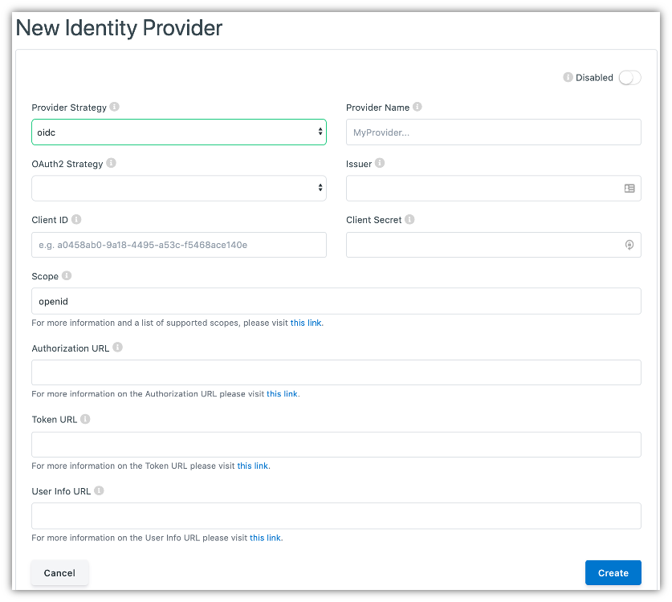

.. _identity-providers:

Identity Providers
###################

Identity Providers (IDPs) are external applications or systems that are able to provide the necessary details needed in order to sign users into Vivvo Trust Platform, connecting the two accounts.
For example, you can configure Vivvo Trust Platform to sign in using Facebook, Google, or even another instance of Vivvo Trust Platform, so long as the integration is set up on both sides.

The list of all available Identity Providers can be accessed by clicking **Identity Providers** under the **Configuration** tab of the sidebar.

.. _view-identity-providers:
Viewing All Identity Providers
*******************************

The initial Identity Providers page displays a list of all of the Identity Providers that have been configured for your instance of Vivvo Trust Platform. Here, you can see a list of IDPs, the federation strategy (SAML, OIDC, etc.) and if the IDP is active.

On this page, you are able to filter the displayed list of Identity Providers by their name, click on an Identity Provider in the list for a more detailed view, or configure a new Identity Provider.

.. _configure-idp:
Configuring a New Identity Provider
************************************

When you’ve determined that a new Identity Provider is needed to be configured, you can click the [**+ Add Identity Provider**] button in the top right of the Identity Providers listing page.

This will bring you to a new view where you will be asked to fill out the vital information needed to configure the Identity Provider.

The general fields that need to be set for every Identity Provider are:

1.	**Enabled/Disabled toggle**: When enabled, users will be able to sign in to Vivvo Trust Platform using this IDP
2.	**Provider Strategy**: The type of federation the IDP supports. Options include SAML, OIDC, and DID Auth
3.	**Provider Name**: The name of the IDP

Depending on the Provider Strategy selected, the remaining form to configure the IDP will change to capture the appropriate information to complete the configuration of the IDP.

.. note::
    If you forget what any of the fields are for, you can hover over the small (i) next to the field labels to get a short description of each.

.. _setup-idp-saml:
Setting up an Identity Provider with SAML (saml)
=================================================

Security Assertion Markup Language (SAML) is an open standard that allows Identity Providers to pass authorization credentials to Service Providers. SAML transactions use Extensible Markup Language (XML) for standardized communications between the identity provider and service providers. SAML is the link between the authentication of a user’s identity and the authorization to use a service. SAML enables Single-Sign On (SSO), a term that means users can log in once, and those same credentials can be reused to log into other service providers.

The fields that need to be set for an Identity Provider with SAML are:

1.	**Metadata URL**: A URL to call out to retrieve the Identity Provider’s SAML metadata.
2.	**SAML Metadata**: The SAML metadata, with a valid EntityID, supplied by the Identity Provider. If a Metadata URL is specified, leave this field empty.

Clicking the [**Cancel**] button will not save any changes you made to the form, and you will be taken back to the Identity Providers listing page.

Clicking the [**Save**] button will then attempt to save the new Identity Provider, and you will be taken to the Identity Providers listing page.

.. _setup-idp-oidc:
Setting up an Identity Provider with OpenID Connect (oidc)
============================================================

OpenID Connect allows a range of clients, including Web-based, mobile, and JavaScript clients, to request and receive information about authenticated sessions and end-users.

The fields that need to be set for an Identity Provider with OpenID Connect are:

1.	**OAuth2 Strategy**: The desired OAuth provider
2.	**Issuer**: The ‘issuer’ identifier of the Identity Provider
3.	**Client ID**: The public Client ID or Application Key of the Provider application
4.	**Client Secret**: The private Client Secret or API Key of the Provider application
5.	**Scope**: The scopes that Vivvo Trust Platform should request - this will impact what data gets populated in the user’s Vivvo Trust Platform profile after successfully authenticating
6.	**Authorization URL**: The User Agent is sent to the Authorization URL for Authentication and Authorization
7.	**Token URL**: To obtain an Access Token, an ID Token, and optionally a Refresh Token, Client sends a Token Request to the Token URL to obtain a Token Response
8.	**User Info URL**: The UserInfo URL is an OAuth 2.0 Protected Resource that returns Claims about the authenticated User

Clicking the [**Cancel**] button will not save any changes you made to the form, and you will be taken back to the Identity Providers listing page.

Clicking the [**Save**] button will then attempt to save the new Identity Provider, and you will be taken to the Identity Providers listing page.

.. _setup-idp-social-login:
Setting up an Identity Provider with Social Login
===================================================

Many modern Identity Providers have implemented their own proprietary OAuth2.0 based protocol with varying levels of similarity to OpenID Connect. Those that fully support OpenID Connect don’t need any special handling in Vivvo Trust Platform and you can select OpenID Connect as the OAuth2 Strategy when setting it up. Google is an example of a social login provider that fully supports OIDC.

As of right now, GitHub is the only proprietary social login provider that we support but we are working on supporting other social login providers. There is no extra information required to use GitHub, simply fill out the form and select GitHub as your OAuth2 Strategy.

.. _setup-passwordless-idp-did-auth:
Setting up a Passwordless Identity Provider (did-auth)
========================================================

A Decentralized Identifier (DID) is a new type of identifier that is globally unique, resolveable with high availability, and cryptographically verifiable. DIDs are typically associated with cryptographic material, such as public keys, and service endpoints, for establishing secure communication channels.

The fields that need to be set for an Identity Provider with did-auth are:

1.	**Client ID**: The public Client ID or Application Key of the Provider application.
2.	**Client Secret**: The private Client Secret or API Key of the Provider application.
3.	**Base URL**: The host URL of the Identity Provider to verify the DID with.

