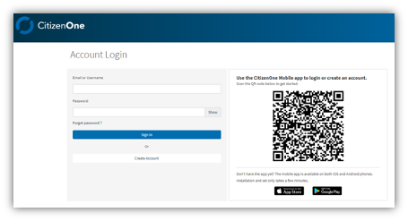
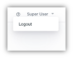

.. _Introduction:
Introduction
###############

The Management Application on the Vivvo Trust Platform gives the client the ability to make different changes to their instance of the platform, view different reports based on different metrics and modify citizen information such as email, address etc.

The app has a lot of features which may differ from one organization’s instance to another. This user guide is a technical communication document that contains instructions on how to use the different features of the Management App. 

.. note::
   Please note that the screenshots contained in this document may not reflect the same branding and style guide as the instance used by the user but steps to perform the action described in this document should remain the same. Also, the Management App has strong Role Based Access Controls (RBAC) for enabling specific functions for certain users. A government organization may have chosen to disable certain functionality in their instance of the management app, meaning some sections in this document are not applicable to every user. 

.. _sidebar_loggingintomanagementapp:
Logging in to the Management App
********************************

A registered user can login to the management app after activating the account. The user can login using the username entered during registration or use any verified email address added to the user’s account. After supplying a username or verified email address along with the correct password, the user logs in by clicking the [**Sign In**] button.

The user can also navigate using the profile button located in the header of the Dashboard. Clicking the profile button may display a menu with the following navigational options:

| **Help** – (the question mark in a circle) Takes the user to the Vivvo Service Desk where you can report incidents, request information or make a service request.
| **Logout** – Signs the user out from the management app and returns the user to login page.

.. note::
    The profile button in the screenshot above may look different depending on the government organization’s styling.

There are also 5 links on the footer of the Dashboard:

| **About Vivvo** – redirects you to the “About Vivvo” webpage on the vivvo.com website
| **Platform Info** – redirects you to the “Platform Info” webpage on the vivvo.com website
| **Solutions** – gives a breakdown of all available solutions on the Vivvo Trust Platform
| **Knowledge** – redirects you to the knowledge database on the vivvo.com website
| **Contact** – redirects you to the “Contact” webpage on the vivvo.com website
