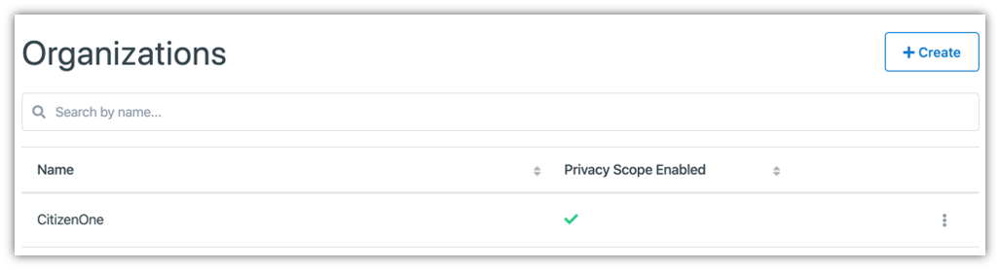
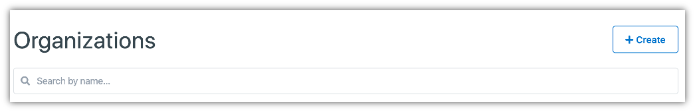
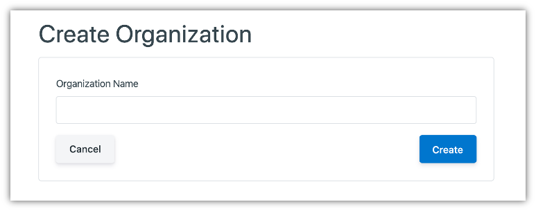
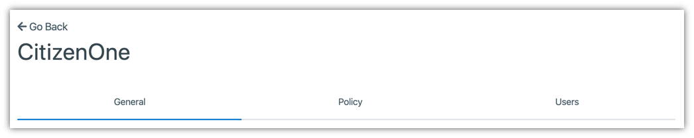
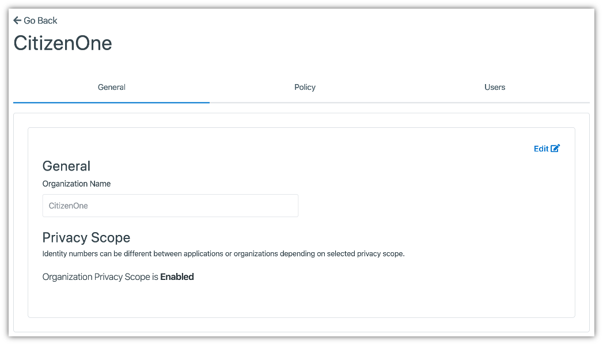
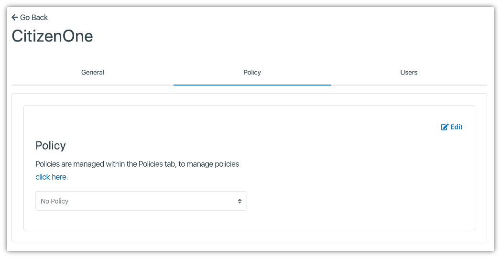
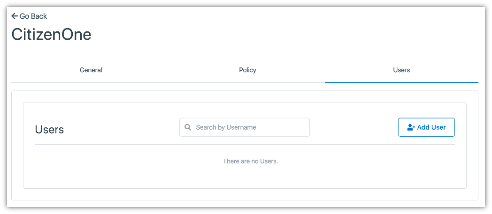
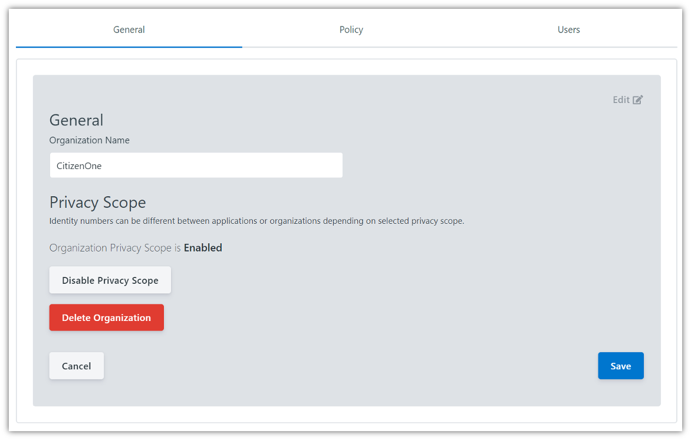

.. _organizations:
Organizations
##############

Organizations are, primarily, a way of categorizing and organizing your :ref:`Applications <applications>`. The Vivvo Trust Platform Management application allows you to configure settings such as :ref:`Policies <policies>` and user access to your Organizations.

The list of all available Organizations can be accessed by clicking **Organizations** under the **Tenants** tab of the sidebar.

.. _view-all-orgs:
Viewing All Organizations
**************************

The initial Organizations page displays a list of all of the Organizations that have been created for your instance of the Vivvo Trust Platform. Here, you can see a small preview of the Organization’s data, namely the name and if the “**Privacy Scope**” option has been enabled.

From this page, you are able to filter the displayed list of Organizations by their name, click on an Organization in the list for a more detailed view, or create a new Organization.

.. note::
    Users that only have the “READ Organizations” role will not be able to create new Organizations or modify existing Organizations.

.. _create-org:
Creating Organizations
***********************

When you’ve determined that a new Organization is needed, you can click the [**+ Create**] button in the top right of the Organization listing page.

This will bring you to a new view where you will be asked to fill out only the vital information needed to create the Organization. Any fields not seen here will be configurable after the Organization has successfully been created.

For Organizations, the only field required is the name of your new Organization.

Clicking the [**Cancel**] button will not save any changes you made to the form, and you will be taken back to the Organization listing page.

Clicking the [**Save**] button will then attempt to make a new Organization with your given name, and you will be taken to the new Organization’s details page.

.. _edit-org:
Viewing and Editing an Organization
*************************************

When you click on or create an Organization, you will be taken to a view with multiple tabs. Each tab contains information that you can fill out to help define and customize your Organization.

Clicking on these tabs changes the view so if you are editing any forms on a page, ensure that you save any changes, or they will be lost on navigation.

.. _org-general-tab:
Organization General Tab
=========================

The General tab of an Organization contains the basic details that define the Organization itself. The two fields that primarily define an Organization are its Name and if the “Policy Scope” has been enabled.

.. note::
    The [**Policy Scope**] toggle determines whether the unique identifier that is assigned to users (of the Vivvo Trust Platform, not Management) will be shared between Organizations.
    
    *When Policy Scope is enabled for an Organization, if a user accesses Organization A’s application and provides data, the data that the application receives will not contain the user’s original identifier, but a new one. If that same user accesses Organization B’s application and provides data, again, a new identifier will be issued.*
    
    This is done to ensure that data cannot be cross-referenced across organizations and compiled to form a single profile on a citizen.

Clicking the [**Edit**] button will enable the fields in the view for change. Ensure your changes are saved before navigating away from the page.

.. _org-policy-tab:
Organization Policy Tab
========================

Organizations, like both :ref:`Applications <applications>` and :ref:`Service Cards <service-cards>`, are Policy holders. Policies applied to an Organization apply to all Applications that belong to the Organization, and likewise all of the Service Cards linked to those Applications.
A Policy can be chosen by navigating to the Policies tab and clicking [**Edit**].
 

.. note::
    If a Policy is selected, a preview of the Policy text will be displayed on this page, below the Policy selection dropdown.

.. _org-users-tab:
Organization Users Tab
========================

By clicking on the Users tab, you will be shown a list of all users that have been assigned to an Organization.

.. note::
    Users in this section refers to those that have been given access to the Vivvo Trust Platform Management application.

Users that have access to the Management application will only be able to see the details of any Organization that they belong to. This includes Applications, if they have also been given the correct permissions to view Applications. Users of an Organization may be added or removed from this page.

.. _remove-org:
Removing an Organization
==========================

When you are on the General tab, click the [**Edit**] button.

Clicking the [**Delete Organization**] button will remove the Organization from the Vivvo Trust Platform. When deleting an Organization, you must accept a confirmation asking whether you want to delete the Organization.

