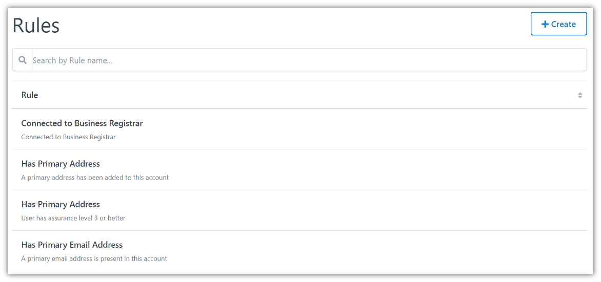
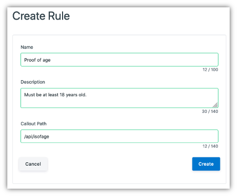
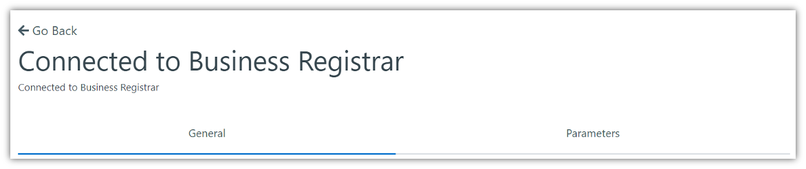
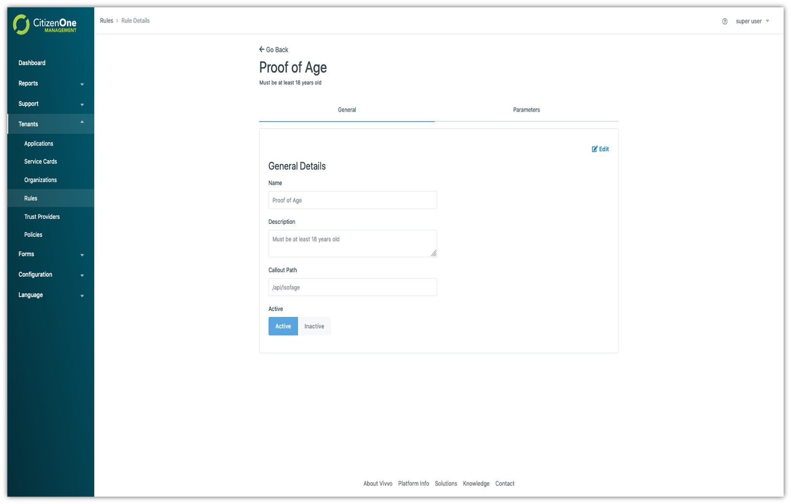
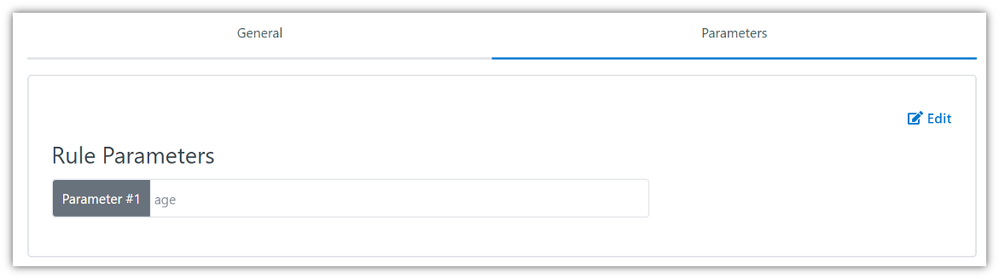
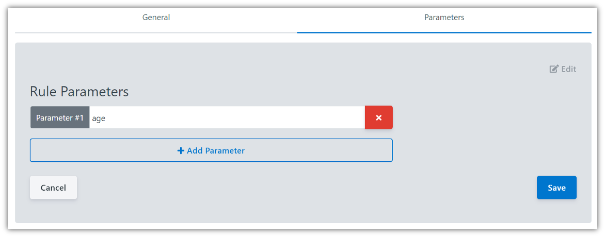
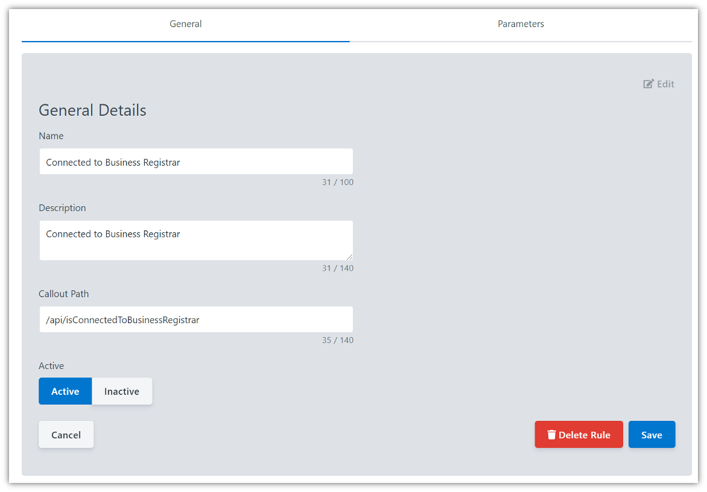

.. _rules:

Rules
######

A Rule is a particular requirement a service has that the citizen must pass in order to access the service. A Rule may have more than one :ref:`Trust Provider <trust-providers>` which can be used to pass the Rule if multiple authoritative sources exist that can fulfill the same claim about the citizen. Rules to access a service are checked every time a citizen accesses a service to ensure they are still passed successfully before proceeding to the service.

The list of all available Rules can be accessed by clicking **Rules** under the **Tenants** tab of the left sidebar.

.. _view-rules:
Viewing All Rules
*****************

The initial Rules page displays a list of all of the Rules that have been created for your instance of the Vivvo Trust Platform.
From this page, you are able to filter the displayed list of Rules by their name, click on a Rule in the list for a more detailed view, or create a new Rule.

.. note::
    Users who only have the “READ Rules” role will not be able to create new Rules, nor will they be able to modify existing Rules.
 

.. _create-rules:   
Creating Rules
***************

A rule can be created in the management app by clicking the [**+ Create**] button

The general fields for a Rule are:

1.	**Name**: The name of the rule
2.	**Description**: The optional description of the rule
3.	**Callout Path**: The API path for implementing the rule

Clicking [**Cancel**] will not save any changes you made to the form, and you will be taken back to the Rules listing page.

Clicking [**Save**] will attempt to make a new Rule and you will be taken to the Rule listings page.

.. _edit-rule:
Viewing and Editing a Rule
**************************

When you click on a Rule, you will be taken to a view with multiple tabs. Each tab contains information that you can fill out to help define and customize your Rules.

Clicking on these tabs changes the view so if you are editing any forms on a page, ensure that you save any changes, or they will be lost on navigation.

.. _rules-general-tab:
Rules General Tab
==================

The General tab of a Rule contains the basic details that define the Rule itself. The three fields that primarily define a Rule are its *Name*, *Description* and the *Callout Path*.
 

Clicking [**Edit**] will enable the fields in the view for change. Ensure your changes are saved before navigating away from the page.

.. _rules-parameters-tab:
Rules Parameters Tab
=====================

The Parameters tab of a Rule contains optional parameters that can be set when added to a :ref:`Policy <policies>`.

Clicking [**Edit**] will enable the fields in the view for change. Ensure your changes are saved before navigating away from the page.

New Parameters can be added while in Edit mode by clicking the [**+ Add Parameter**] button. The only field required for a Parameter is the **Name**.
Parameters can also be removed while in Edit mode by clicking the [**X**] button next to a Parameter.

.. _remove-rule:
Removing a Rule
================

When you are on the General tab, click the [**Edit**] button.

Clicking the [**Delete Rule**] button will remove the Rule from Vivvo Trust Platform. When deleting a Rule, you must accept a confirmation asking whether you want to delete the Rule.

