.. _service-cards:
Service Cards
###############

A Service Card is the digital representation of a service and is how the citizen accesses the service from Vivvo Trust Platform. A Service Card will belong to one or more :ref:`Applications <applications>` defined in Vivvo Trust Platform. A Service Card may have its own :ref:`Policy <policies>` that will be presented along with any Application(s) and Organization(s) Policies that have been defined that relate to the Service Card. The Service Card may also have :ref:`Rules <rules>` that need to be passed in order to access the service. Once the citizen successfully connects to the service, a list of tasks will be presented to the citizen that will navigate the user to the appropriate form or screen in an application.

Service Cards are the way in which citizens access digital services through Vivvo Trust Platform. They provide a common onboarding workflow across all tenant services regardless of the services technical state (i.e. modern web application or older legacy system). The Vivvo Trust Platform Management application allows you to manage the services being offered by configuring service cards.

The list of all available Service Cards can be accessed by clicking **Service Cards** under the **Tenants** tab of the left sidebar.

.. _view-all-service-cards:
Viewing All Service Cards
***************************

The initial Service Cards page displays a list of all Service Cards that have been created for your instance of Vivvo Trust Platform. They appear as cards to show how they will appear on a citizen’s dashboard page.

On this page, you are able to filter the displayed list of Service Cards by their name, click on a Service Card in the list for a more detailed view, or create a new Service Card.

.. note::
    Users that have been granted only the “READ Service Cards” role will not be able to create new Service Cards or modify existing ones.

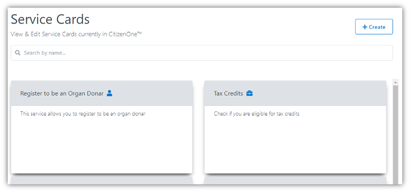

.. _create-service-card:
Creating Service Cards
***********************

When you’ve determined that a new Service Card is needed, you can click the [**+ Create**] button in the top right of the Service Card listing page.

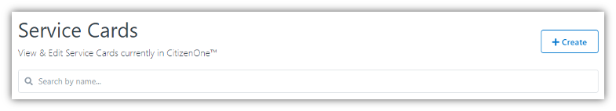

The tabs for a new Service Card are:

| **Details**: The basic information of the Service Card
| **Tasks**: The tasks the citizen can complete for the Service Card
| **Policy**: The policy of the Service Card
| **Review**: Reviewing all Service Card information before creating

.. note::
    To create a service card, you will need to:

    1. :ref:`Create a Policy<create-policy>` (if applicable)
    2. :ref:`Create an Organization<create-org>` (if applicable)
    3. :ref:`Create an Application<create-apps>` (if applicable)
    4. :ref:`Create a Rule<create-rules>` (if applicable)
    5. :ref:`Create a Trust Provider<create-trust-provider>` (if applicable)

    Please refer to the pages above to setup these prerequisites before you proceed.

.. _service-card-details:
Service Card Details
=====================

The general fields for the details of a Service Card are:

1.	**Title**: The title of the service card
2.	**Service Card Type**: The type of Service Card, typically Personal or Business, that determines if the Service Card is accessible by citizens or businesses
3.	**Description**: An optional description that appears on the service card
4.	**Pilot**: If set, Pilot Mode will remove the service card from the service catalog, but remain available through direct access

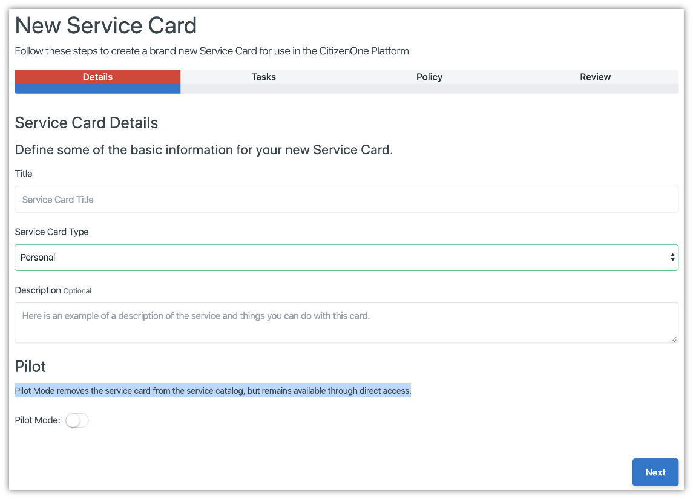

Clicking [**Next**] will take you to the Tasks tab.

.. _service-card-tasks:
Service Card Tasks
===================

Tasks can be added to Service Cards in two ways. The first way is to add static Tasks that are always displayed and accessible to all users. The second way is through dynamic Tasks set on a Policy. This is defined by specifying an API endpoint that Vivvo Trust Platform will use to call out to the application and retrieve a set of Tasks specific to the user accessing the Service Card.

The steps below describe how to add static Tasks.

.. _add-service-task:
Adding a Service Card Task
---------------------------

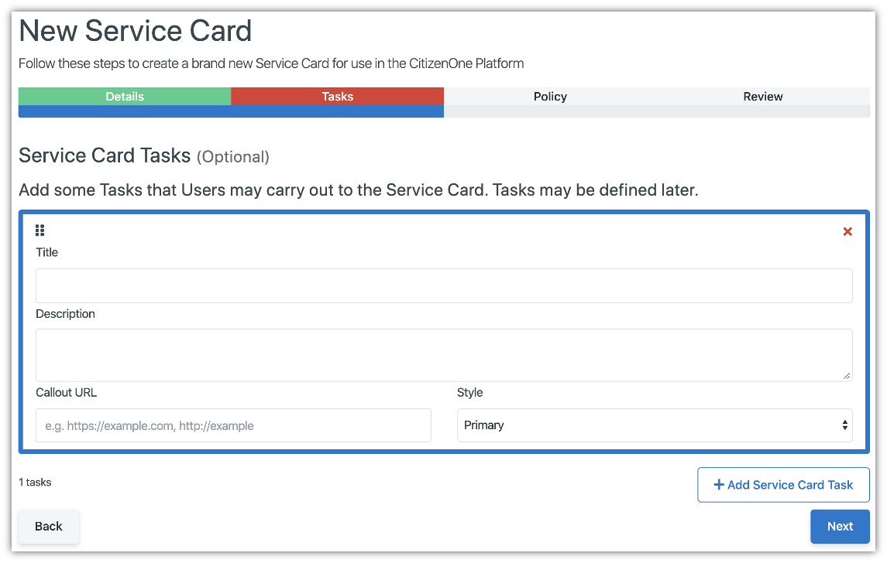

The general fields for a Task are:

1.	**Title**: The title of the Service Card Task
2.	**Description**: An optional description that appears below the Task Title
3.	**Callout URL**: The navigation link to send the user for this Task
4.	**Style**: The service card background color, ‘Primary’, ‘Second’, ‘Danger’, ‘Warning’ and ‘info’

.. _reorder-service-tasks:
Reordering Service Card Tasks
------------------------------

The Service Card Tasks can be reordered by dragging the Task.

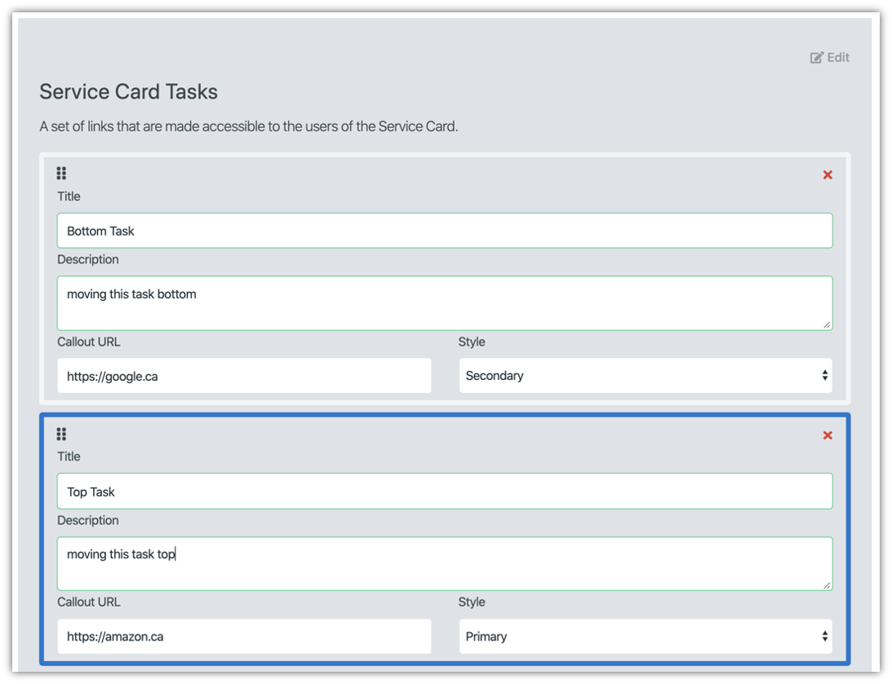

.. _remove-service-task:
Removing Service Card Tasks
----------------------------

You can remove a Service Card Task by clicking the red [**X**] button on the top right corner.

 .. image:: ../images/managementapp/remove-service-card-task.png
   :width: 300pt
   :alt: Remove service card task
   :align: center 

Clicking [**Back**] will take you back to the Details tab.

Clicking [**Next**] will take you to the Policy tab.

.. _service-card-policy:
Service Card Policy
====================

A Service Card will inherit the Policy(ies) set at the Application, Organization and Tenant level associated with the Service Card, if they exist. Optionally, you can also set a Policy at the Service Card level.

If a Policy should be set for the specific Service Card, select one from the drop-down.

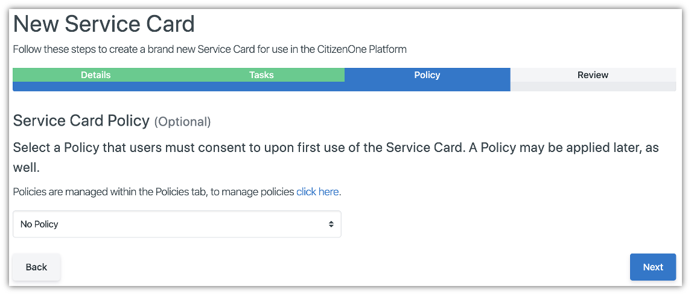

Clicking [**Back**] will take you back to the Tasks tab.

Clicking [**Next**] will take you to the Review tab.

.. _service-card-review:
Service Card Review
====================

The Service Card Review tab will show all Service Card information including basic Details, Pilot Mode, Tasks and the Policy. If any information needs to be changed, click the [**Back**] button to go to previous tabs and correct the information.

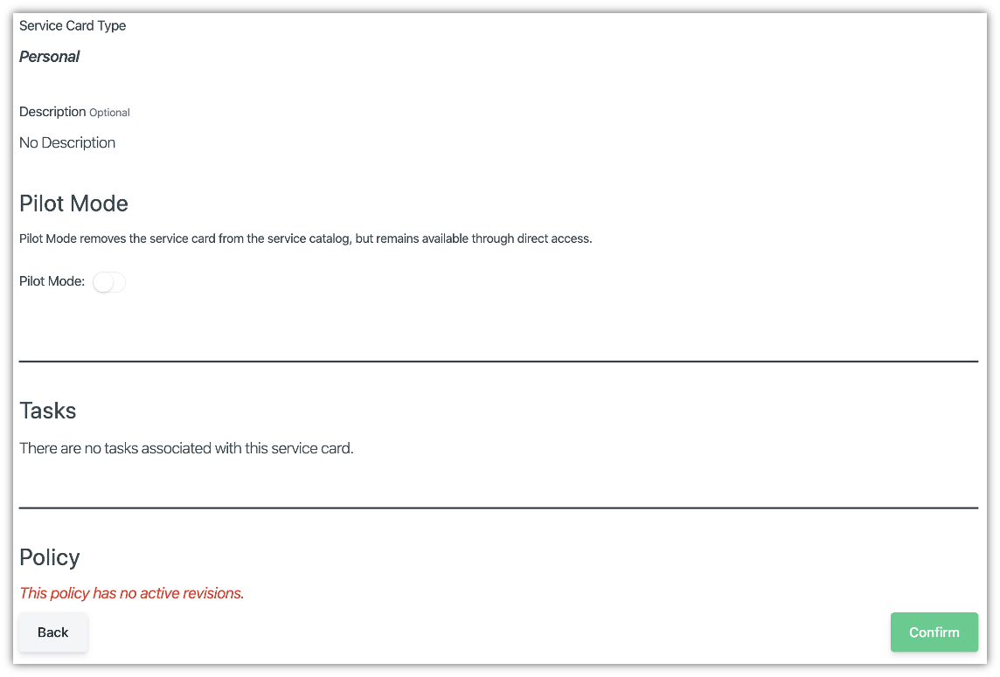

Clicking [**Back**] will take you back to the Policy tab.

Clicking [**Confirm**] will create the Service Card, and you will be taken to the new Service Card’s details page.

.. _edit-service-card:
Editing a Service Card
***********************

When you click on or create a Service Card, you will be taken to a view with multiple tabs. Each tab contains information that you can fill out to help define and customize the Service Card.

The Details, Tasks and Policy tasks show the relevant Service Card information and can be edited in a similar way described in the Creating Service Cards section of this document.

There are additional tabs that can be accessed that provide further customization of a Service Card. These are:

| **Forms**: Link a Form to be accessed through a Task on the Service Card
| **Contacts**: Contact Information for the Service Card
| **Applications**: Application(s) associated with the Service Card

.. _link-form-service-card:
Linking Forms to Service Cards
================================

The Service Card Form tab allows you to link a Form to a Service Card causing the Form to appear as a Task on the Service Card.

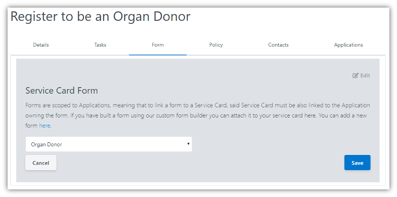

Clicking [**Edit**] will enable the fields in the view for change. You can specify information for one or more contacts using the fields shown. Ensure your changes are saved before navigating away from the page.

In order to link a Form to a service card you need to:

1.	Make sure the service card is connected to an Application
2.	Make sure that the service card Application has a Policy
3.	Create a form in the same Organization and Application that is linked to the Service Card
4.	Navigate to the Form tab for your Service Card and select the Form from the list

.. _service-card-contacts:
Service Card Contacts
======================

The Service Card Contacts tab allows you to add relevant contact information about the Service Card.

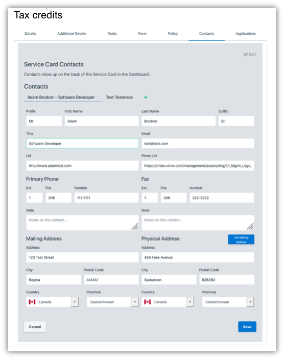

Clicking [**Edit**] will enable the fields in the view for change. You can specify information for one or more contacts using the fields shown. Ensure your changes are saved before navigating away from the page.

The contact information entered will be shown on the back of the service card.
 
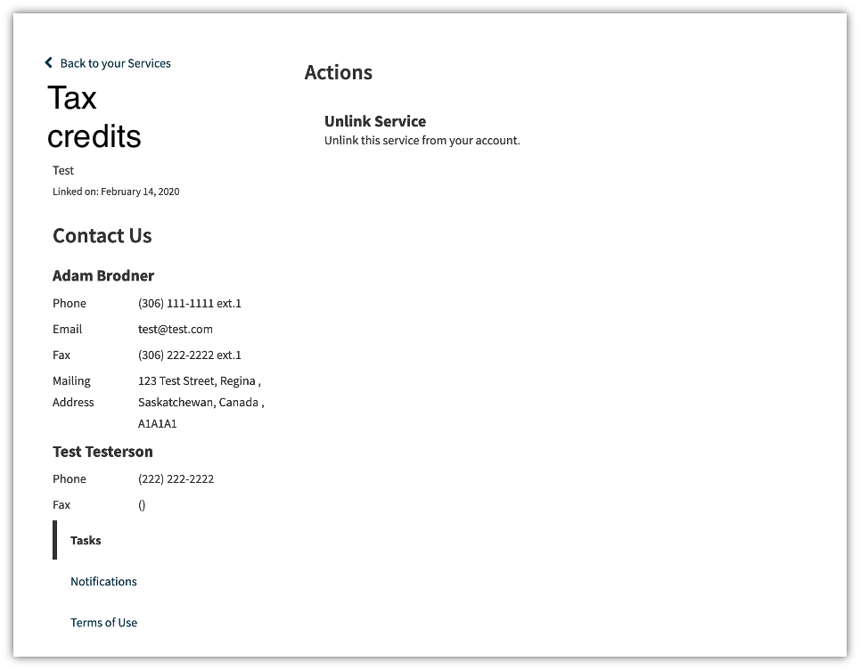

.. _link-service-card-apps:
Linking Service Cards to Applications
======================================

The Service Card Contacts tab allows you to view which Application(s) are attached to a Service Card.
 
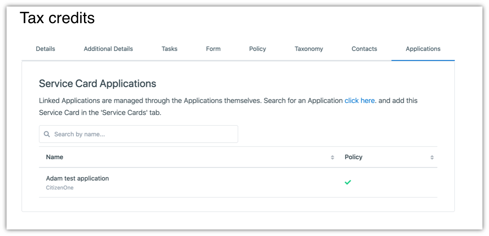

You cannot link or unlink Applications from Service Cards on this page. However, clicking the **click here** link will take you to the Applications page where you can add or remove Service Cards to/from Applications. For more details see the Application Service Cards Tab.
