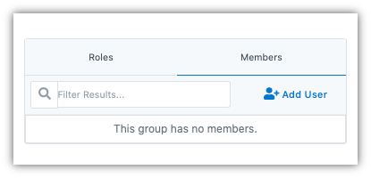

.. _user-access-management:

User Access Management
#######################

You can invite new users to the management app on your instance of the Vivvo Trust Platform. You can invite new users, assign different roles to users and manage user group associations.

The list of active and pending users can be accessed by clicking **User Access Management** under the **Configuration** tab of the sidebar. There are two tabs: Users and Groups

 
.. _users-tab:
Users Tab
**********

You can invite a new user by clicking [**+ Invite User**] which then opens the **Invite User** page.

Enter the username or email of the user and click on the [**+ Add User**] button. Select the roles, groups and/or organizations that you want the user to be a member of, then click on [**Send Invite**]. An email will be sent to the user with an activation link which they need to click on to get the required access to the management app.

You can resend the activation email to users whose activation links may have expired by clicking on the [**Resend**] button next to the user email.
 

.. _groups-tab:
Groups Tab
***********

You can view all the groups that have been created on the management app here. You can add roles to groups and also add members.

To create a new group, simply click on the [**+Create Group**] button which will open a **New Group** page. Enter the name and description of the group, then click on [**Create**].

Add roles to the group by clicking on [**Add Role**] and selecting the desired roles from the dropdown menu.

To add members to the group, click on the **Members** tab, then click the [**Add User**] button, select the users from the **Add User to Group** dialog box and click [**Add**]. 

Clicking the [**Cancel**] button will not save any changes you made to the form, and you will be taken back to the Group listing page.

To delete a group, click on the group in the group list, click on [**Edit**] and then click on [**Delete Group**]. When deleting a Group, you must accept a confirmation asking whether you want to delete the Group.
 
