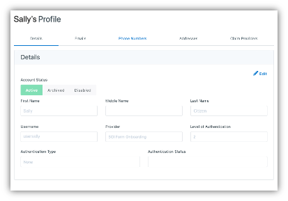
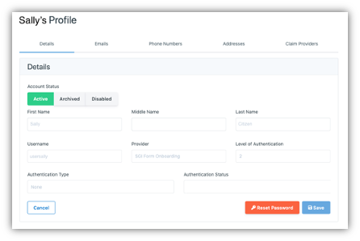
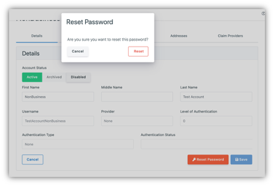
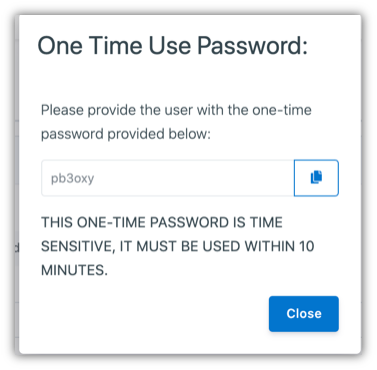
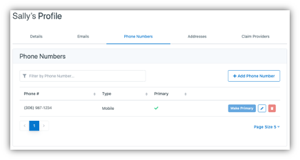
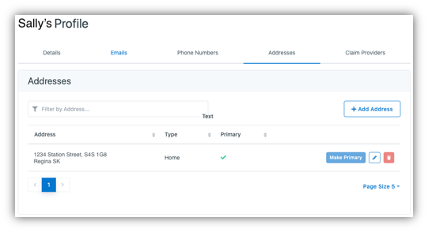
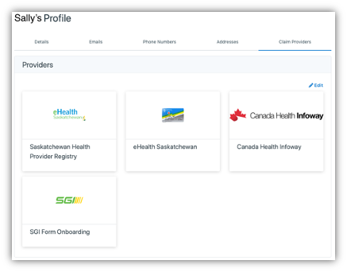

.. _citizen-lookup:

Citizen Lookup
###############

A citizen’s information can be accessed by clicking **Citizen Lookup** under the **Support** tab of the sidebar.

You can look up and modify the citizen’s information here. Simply search for the citizen by typing in the email or username and support code, then click on [**Search**].

.. note::
    You may look up a citizen’s information without a support code, but this will be logged as a security event. A warning dialog box will pop up whenever this is the case.

.. _view-edit-user details:

Viewing and Editing User Details
*********************************

You can view the user’s personal details on the account by clicking on the **Details** tab.

After clicking on [**Search**], you will land on the profile details page (shown above). To modify any of the details, click on [**Edit**] in the top right corner of the page. You will then be able to change the Account Status (Active, Archived or Disabled), First Name, Middle Name and Last Name and Reset Password.

.. _reset-user-passwords:

Resetting User Passwords
*************************

As an admin, you can reset the password of a citizen. A TOTP (Time-based One Time Password) will be created for the citizen which s/he needs to use to login and reset his/her password on the platform. 

.. note::
    The TOTP will only be available for 10 minutes and should only be created by admin to support end users when the user email is unavailable. Otherwise [**Forget Password**] should be used by end users to reset their password themselves.

After clicking the [**Edit**] button, and then clicking the [**Reset Password**] button, click the [**Reset**] button on the dialog box that pops up on the page. 

Another dialog box displaying the 6-digit TOTP will pop up. Click on the blue [**Copy**] icon to the right of the TOTP to copy and send it to the user within 10 minutes.

.. _view-edit-user-email:

Viewing and Editing User Email Addresses
******************************************

You can view all email addresses on the user account by clicking on the **Emails** tab.
 
You can add more email addresses to a user’s account by simply clicking [**+ Add Email**]. You may also choose the primary email by clicking on the [**Make Primary**] button to the right of the email address.

.. image:: ../images/managementapp/edit-user-email.png
   :width: 300pt
   :alt: Edit User Email Address
   :align: center 

.. _view-edit-user-phone:

Viewing and Editing User Phone Numbers
****************************************

You can view all phone numbers on the user account by clicking on the **Phone Numbers** tab.
 

You can add a phone number to the user’s account by clicking on [**+ Add Phone Number**]. You may also choose the primary phone number to which notifications can be sent by clicking the [**Make Primary**] button to the right of the phone number. 

.. _view-edit-user-address:

Viewing and Editing User Addresses
*************************************

You can view all addresses on the user account by clicking on the **Addresses** tab.

 
You can add an address to the user’s account by clicking on [**+Add Address**]. You may also choose the user’s primary address by clicking the [**Make Primary**] button to the right of the address. 

Resetting Claim Provider Tokens
You can view all claim provider tokens on a user account by clicking on the Claim Providers tab

To remove any of the tokens, simply click on the [**Edit**] button, click on [**Remove Token**], and then click [**Done**].
 
.. image:: ../images/managementapp/remove-token.png
   :width: 300pt
   :alt: Remove Claim Provider Tokens
   :align: center 
